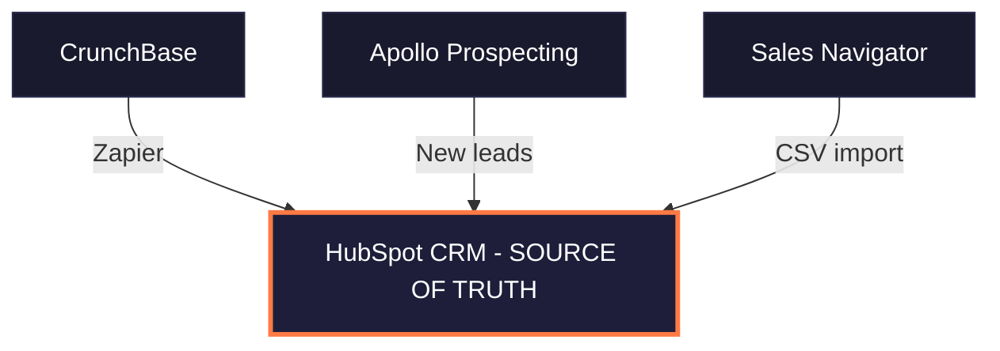
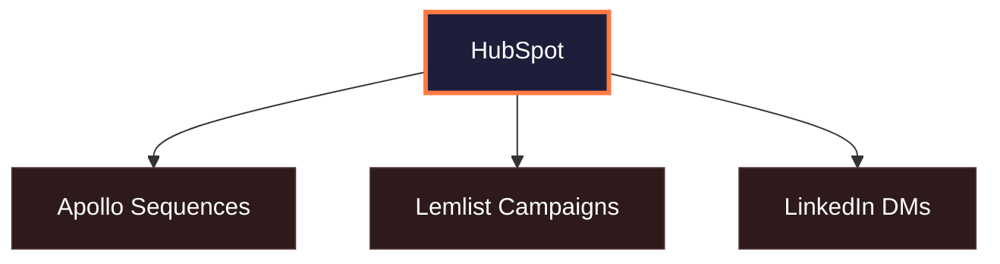
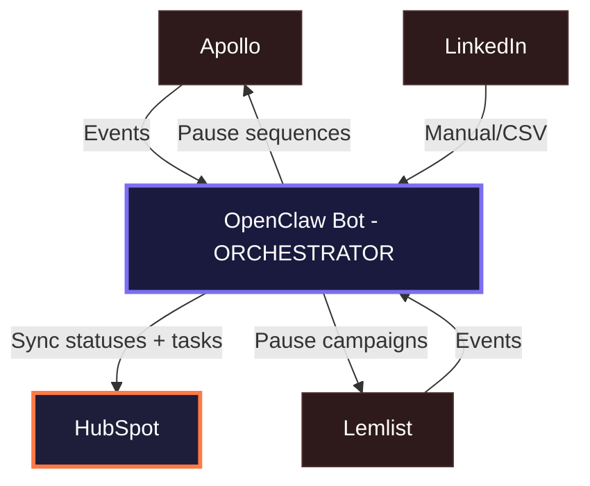
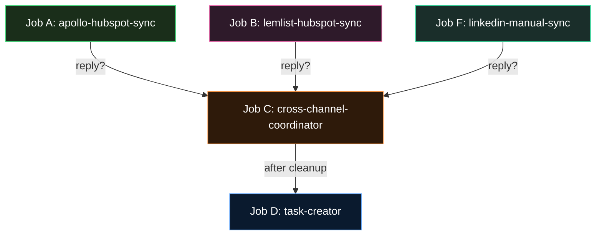
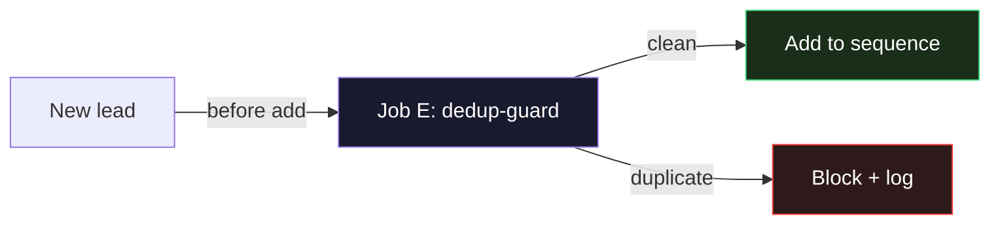
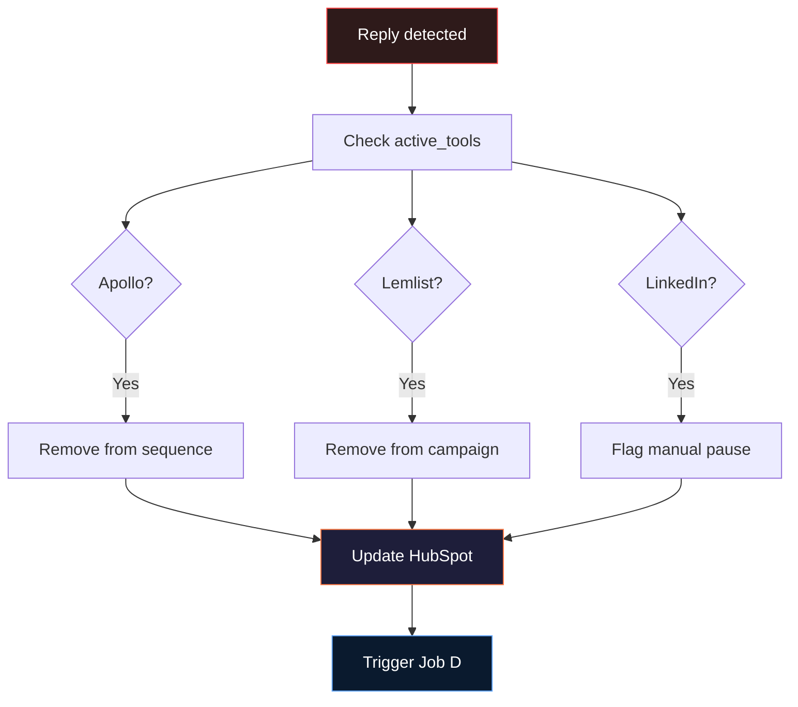
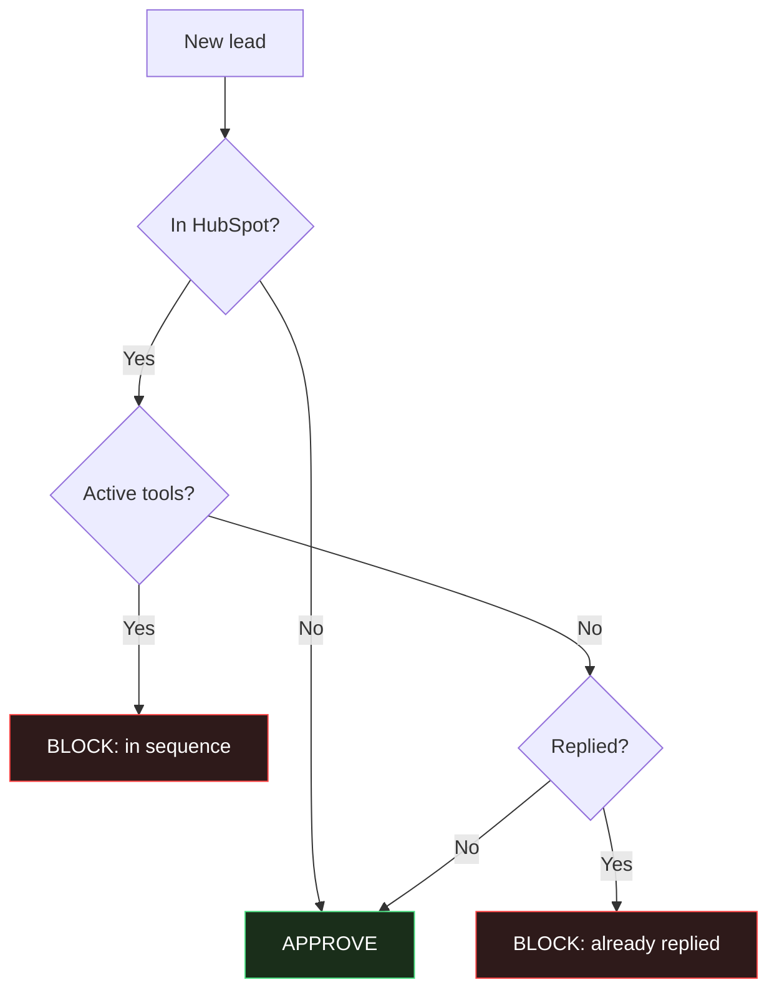

# Kernelics Email Outreach Automation

> HubSpot (source of truth) + Apollo + Lemlist + Sales Navigator + OpenClaw orchestrator

---

## System Overview

### 1. Lead Sources → HubSpot

### 2. Enrichment Loop

### 3. Outreach Channels

### 4. OpenClaw Orchestration

### 5. Outcomes

---

## OpenClaw Jobs

### Scheduled Jobs (cron)

### Pre-hook Job

| Job | Type | Schedule | Description |
|-----|------|----------|-------------|
| A | Cron | Every 15 min | Apollo → HubSpot status sync |
| B | Cron | Every 15 min | Lemlist → HubSpot status sync |
| C | Event | On reply | Pause all other channels for lead |
| D | Event | After C | Create HubSpot task for you |
| E | Pre-hook | Before add | Block duplicates across tools |
| F | Cron | Daily | LinkedIn CSV → HubSpot sync |

---

## Job A: Apollo → HubSpot Status Sync

**Schedule:** Every 15 minutes

| Step | Action | API Call | Tool |
|------|--------|----------|------|
| 1 | Poll Apollo sequences for active contacts | `GET /v1/emailer_campaigns/{id}/emailer_steps` | Apollo |
| 2 | Get current step, open/reply/bounce status per contact | (included in step 1 response) | Apollo |
| 3 | Match leads to HubSpot contacts by email | `POST /crm/v3/objects/contacts/search` | HubSpot |
| 4 | Batch-update HubSpot properties | `POST /crm/v3/objects/contacts/batch/update` | HubSpot |
| 5 | If reply detected → trigger Job C | internal event | OpenClaw |

**API calls per cycle:** ~2-3 Apollo + 1-2 HubSpot batch calls
**Handles:** Up to 100 contacts per batch (HubSpot limit)

---

## Job B: Lemlist → HubSpot Status Sync

**Schedule:** Every 15 minutes

| Step | Action | API Call | Tool |
|------|--------|----------|------|
| 1 | Poll Lemlist campaign exports | `GET /api/campaigns/{id}/export` | Lemlist |
| 2 | Map statuses: emailsSent/Opened/Replied/interested/notInterested | (mapping logic) | OpenClaw |
| 3 | Match to HubSpot contacts by email | `POST /crm/v3/objects/contacts/search` | HubSpot |
| 4 | Batch-update HubSpot properties | `POST /crm/v3/objects/contacts/batch/update` | HubSpot |
| 5 | If interested/replied → trigger Job C | internal event | OpenClaw |

**API calls per cycle:** 1 Lemlist export + 1-2 HubSpot batch calls
**Note:** Lemlist has webhooks — can switch to push-based later

---

## Job C: Cross-Channel Reply Coordination

**Trigger:** Called by Job A or B when reply detected

**Critical:** This prevents the "already in contact but still getting automated emails" problem

---

## Job D: HubSpot Task Creation on Reply

**Trigger:** Called by Job C after cross-channel cleanup

| Step | Action | API Call |
|------|--------|----------|
| 1 | Create follow-up task | `POST /crm/v3/objects/tasks` |
| | Subject: "Reply from {name} via {channel}" | |
| | Body: sequence step #, reply snippet, outreach history | |
| | Due: today, assigned to you | |
| 2 | Associate task with contact + deal | `PUT /crm/v3/objects/tasks/{id}/associations/contacts/{contactId}` |
| 3 | Add note with full reply context | `POST /crm/v3/objects/notes` |
| 4 | Move deal to "Engaged" stage | `PATCH /crm/v3/objects/deals/{id}` |

**Result:** You see the task in HubSpot → handle the reply manually

---

## Job E: Dedup Guard

**Trigger:** Before any lead is added to a new sequence

**Prevents:** Same lead getting emails from Apollo AND Lemlist simultaneously

---

## Job F: LinkedIn Manual Sync

**Schedule:** Daily (or on-demand)

| Step | Action | Tool |
|------|--------|------|
| 1 | Read Sales Navigator CSV export | OpenClaw |
| 2 | Parse: connection status, InMail status, DM replies | OpenClaw |
| 3 | Match to HubSpot contacts by name + company | HubSpot |
| 4 | Update HubSpot: outreach_channel, LinkedIn status in notes | HubSpot |
| 5 | If LinkedIn reply detected → trigger Job C | OpenClaw |

**Limitation:** No Sales Navigator API — least automated part
**Future upgrade:** Lemlist Multichannel Expert can automate LinkedIn steps and feed back via API

---

## Sync Matrix

| Data Point | Source | Destination | Direction | Synced By | Frequency |
|-----------|--------|-------------|-----------|-----------|-----------|
| Company accounts | CrunchBase | HubSpot | → | Zapier (existing) | Real-time |
| Contacts (new leads) | Apollo | HubSpot | ↔ | **OpenClaw** | Every 15 min |
| Contact enrichment | Apollo | HubSpot | → | Apollo native + **OpenClaw** | On enrichment |
| Email sequence step # | Apollo | HubSpot | → | **OpenClaw** | Every 15 min |
| Email open/click events | Apollo | HubSpot | → | **OpenClaw** | Every 15 min |
| Email reply status | Apollo | HubSpot | → | **OpenClaw** | Every 5 min |
| Lemlist campaign status | Lemlist | HubSpot | → | **OpenClaw** | Every 15 min |
| Lemlist reply/interested | Lemlist | HubSpot | → | **OpenClaw** | Every 5 min |
| LinkedIn outreach status | Sales Navigator | HubSpot | → | **OpenClaw** | Manual/CSV |
| Deal stage updates | HubSpot | — | internal | **OpenClaw** | On event |
| Task creation (on reply) | OpenClaw | HubSpot | → | **OpenClaw** | On event |
| Pause sequence (cross-channel) | OpenClaw | Apollo / Lemlist | → | **OpenClaw** | On reply event |
| Dedup check | HubSpot | Apollo / Lemlist | ← | **OpenClaw** | Before add |
| Buying intent signals | Apollo | HubSpot | → | **OpenClaw** | Daily |

---

## HubSpot Custom Properties

Create these in **HubSpot Settings → Properties → Contact properties**:

| Property Name | Type | Options / Format | Purpose |
|--------------|------|-----------------|---------|
| `outreach_channel` | Dropdown | email / linkedin / both / none | Which channels are active |
| `sequence_step` | Number | 1, 2, 3... | Current step in active sequence |
| `reply_status` | Dropdown | no_reply / replied / meeting_booked / not_interested | Latest reply state |
| `active_tools` | Text | apollo / lemlist / linkedin (comma-separated) | Which tools have active sequences |
| `last_sync_timestamp` | DateTime | ISO 8601 | Last OpenClaw sync time |
| `reply_channel` | Dropdown | apollo_email / lemlist_email / linkedin_dm / inmail | Where the reply came from |
| `apollo_campaign_id` | Text | Apollo campaign ID | Link back to Apollo sequence |
| `lemlist_campaign_id` | Text | Lemlist campaign ID | Link back to Lemlist campaign |
| `intent_score` | Number | 1-100 | Apollo buying intent score |

---

## API Limits & Plan Constraints

### HubSpot Starter

| Limit | Value |
|-------|-------|
| API rate limit | 100 requests / 10 sec |
| Daily API limit | 250,000 requests |
| Batch operations | 100 records per batch |
| Custom properties | 1,000 per object |
| Workflows | **NOT available (Pro+)** |
| Webhooks | **Limited (no workflow triggers)** |
| Contacts | 1,000 marketing (unlimited non-marketing) |
| Tasks / Deals | Unlimited |

### Apollo Basic

| Limit | Value |
|-------|-------|
| API rate limit | **5 requests / min** |
| Sequences | Available |
| Sequence API | Read + add/remove contacts |
| Enrichment API | Available (costs credits) |
| Webhooks | **NOT available (requires Pro)** |
| Buying intent | Available |

### Lemlist

| Limit | Value |
|-------|-------|
| API rate limit | 10 requests / sec |
| Campaign API | Full CRUD |
| Lead management | Add/remove/update |
| Webhooks | Available on paid plans |
| Multichannel | Email + LinkedIn (Multichannel Expert) |

### Sales Navigator

| Limit | Value |
|-------|-------|
| Official API | **No public API** |
| Data export | CSV export (manual) |
| CRM sync | **Native HubSpot sync requires Pro+** |
| Workaround | CSV import + OpenClaw processing |

---

> **Key Bottleneck:** Apollo Basic = 5 API requests/min. The whole sync architecture is designed around this limit. If you scale beyond ~500 active leads, consider upgrading Apollo for higher rate limits and webhook support (push-based instead of polling).
