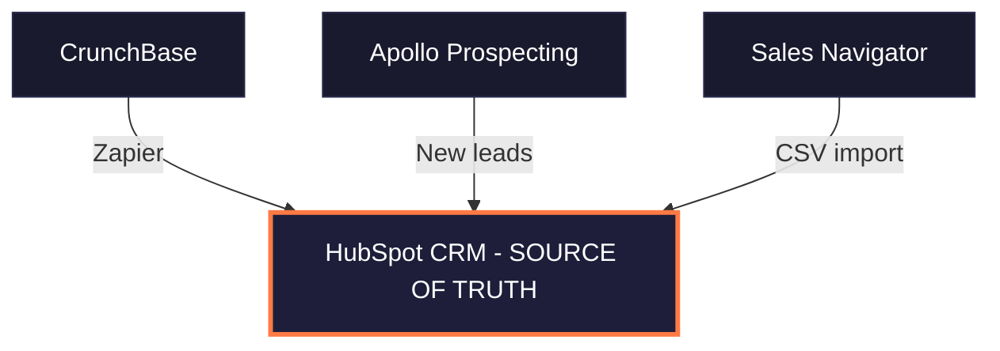
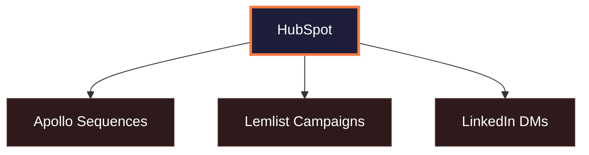
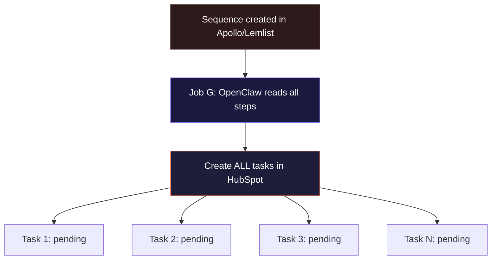
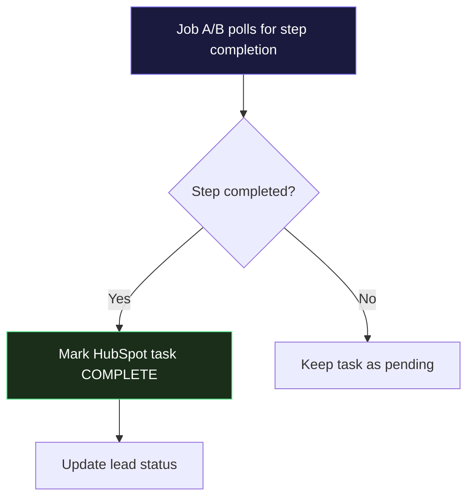
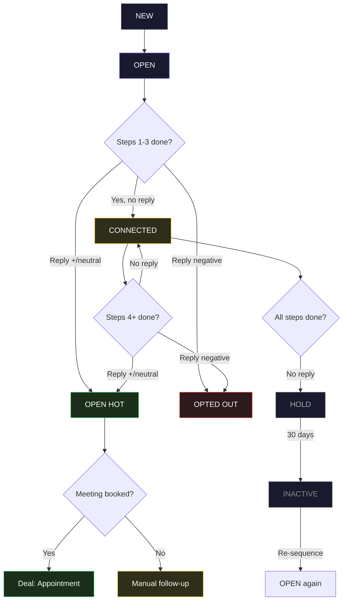
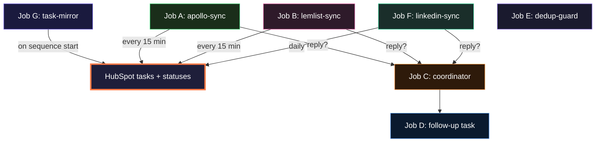
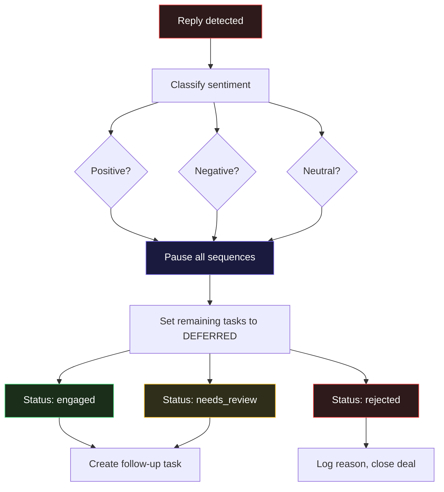
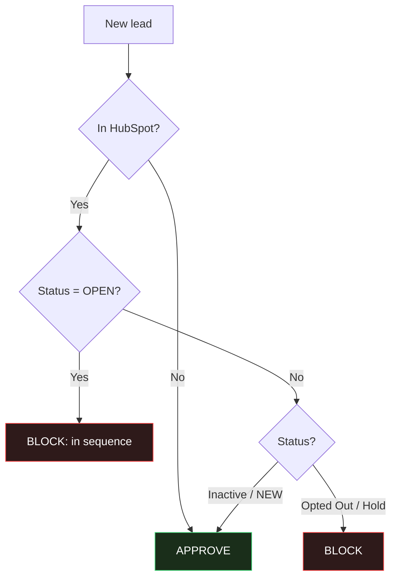
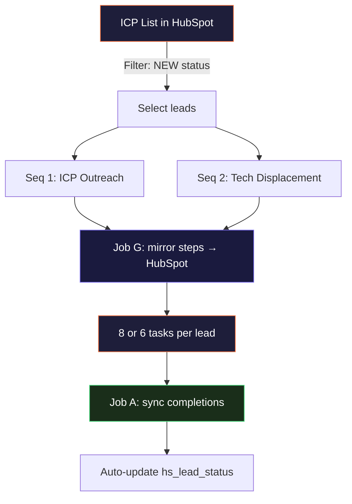

# Kernelics Email Outreach Automation

> HubSpot (source of truth) + Apollo + Lemlist + Sales Navigator + OpenClaw orchestrator

---

## System Overview

### 1. Lead Sources → HubSpot

### 2. Enrichment Loop

### 3. Outreach Channels

### 4. OpenClaw Orchestration

### 5. Outcomes

---

## Full Task Mirroring

**Core principle:** Every step in every sequence (Apollo, Lemlist, LinkedIn) is mirrored as a HubSpot task. You always see where every lead is across all channels.

### Example: 8-step multichannel sequence

| Step | Channel | Action | HubSpot Task Created |
|------|---------|--------|---------------------|
| 1 | Email (Apollo) | Send intro email | "Step 1/8: Intro email — {name}" |
| 2 | Email (Apollo) | Follow-up email | "Step 2/8: Follow-up — {name}" |
| 3 | LinkedIn | Send connection request | "Step 3/8: LinkedIn connect — {name}" |
| 4 | LinkedIn | Like/comment their post | "Step 4/8: LinkedIn engage — {name}" |
| 5 | Email (Apollo) | Value email | "Step 5/8: Value email — {name}" |
| 6 | LinkedIn | Send pitch DM | "Step 6/8: LinkedIn pitch — {name}" |
| 7 | Email (Apollo) | Case study email | "Step 7/8: Case study — {name}" |
| 8 | Email (Apollo) | Breakup email | "Step 8/8: Breakup — {name}" |

### How task mirroring works

### Task types and statuses in HubSpot (actual values)

**Task types** (use `hs_task_type`):

| API Value | Label | Used For |
|-----------|-------|----------|
| `EMAIL` | Email | Apollo/Lemlist email steps |
| `LINKED_IN` | LinkedIn | LinkedIn engagement (like, comment) |
| `LINKED_IN_CONNECT` | Sales Navigator - Connection Request | LinkedIn connection requests |
| `LINKED_IN_MESSAGE` | Sales Navigator - InMail | LinkedIn DMs and InMails |
| `CALL` | Call | Phone call steps |
| `TODO` | To Do | Follow-up tasks, manual actions |

**Task statuses** (use `hs_task_status`):

| API Value | Label | Meaning |
|-----------|-------|---------|
| `NOT_STARTED` | Not Started | Step not yet executed |
| `IN_PROGRESS` | In Progress | Step currently being processed |
| `COMPLETED` | Completed | Step executed (email sent, action done) |
| `DEFERRED` | Deferred | Paused — lead replied on another channel |
| `WAITING` | Waiting | Waiting for external event (e.g. wait step) |

---

## Automatic Lead Status Management

Uses HubSpot's built-in `hs_lead_status` field. Your current options and how we map them:

### Status mapping (hs_lead_status)

| HubSpot Value | API Value | Our Usage | Automation Trigger |
|--------------|-----------|-----------|-------------------|
| **New** | `NEW` | Lead just entered HubSpot, not yet in any sequence | Default on import |
| **Open** | `OPEN` | Lead added to a sequence, outreach in progress | Job G: on sequence start |
| **Connected** | `CONNECTED` | Steps 1-3 completed, no reply yet | Job A/B: step count check |
| **Open Hot** | `Open Hot` | Reply received (positive or neutral) — needs attention | Job C: on positive/neutral reply |
| **Opted Out** | `Opted Out` | Reply was negative ("not interested", "unsubscribe") | Job C: on negative reply |
| **Unqualified** | `UNQUALIFIED` | Lead doesn't match ICP after review | Manual |
| **Hold** | `Hold` | All sequence steps done, no reply — wait 30 days | Job A/B: all steps completed |
| **Inactive** | `Inactive` | 30+ days on hold, no engagement — can re-sequence later | Job A: timer expiry |

> No custom status values needed. The built-in options cover every state.

### Status flow diagram

### Status rules (what OpenClaw enforces)

| Trigger | hs_lead_status | API Value | Additional Actions |
|---------|---------------|-----------|-------------------|
| Lead added to sequence | Open | `OPEN` | Create all HubSpot tasks |
| Steps 1-3 completed, no reply | Connected | `CONNECTED` | — |
| ALL steps completed, no reply | Hold | `Hold` | Stop monitoring |
| Reply — positive (any step) | Open Hot | `Open Hot` | Pause all sequences, create follow-up task |
| Reply — neutral/OOO (any step) | Open Hot | `Open Hot` | Pause all sequences, create review task |
| Reply — negative (any step) | Opted Out | `Opted Out` | Pause all sequences, move deal to Closed Lost |
| Meeting booked | — | — | Remove from sequences, deal → Appointment Scheduled |
| 30 days on Hold, no engagement | Inactive | `Inactive` | Can be re-added to different sequence |
| Manual review: doesn't match ICP | Unqualified | `UNQUALIFIED` | Remove from sequences |

### Reply sentiment detection

OpenClaw classifies replies into 3 categories:

| Category | Example phrases | → hs_lead_status |
|----------|----------------|-----------------|
| **Positive** | "Sure, let's talk", "Send more info", "When are you free?" | `Open Hot` |
| **Negative** | "Not interested", "Remove me", "Don't contact me" | `Opted Out` |
| **Neutral** | "Who are you?", "What company?", auto-replies, OOO | `Open Hot` + review task |

---

## OpenClaw Jobs (Updated)

### Job overview

| Job | Type | Schedule | Description |
|-----|------|----------|-------------|
| **G** | Event | On sequence start | Mirror ALL sequence steps as HubSpot tasks |
| **A** | Cron | Every 15 min | Apollo → HubSpot: mark tasks complete, update status |
| **B** | Cron | Every 15 min | Lemlist → HubSpot: mark tasks complete, update status |
| **C** | Event | On reply | Classify reply, pause other channels, update status |
| **D** | Event | After C | Create manual follow-up task with context |
| **E** | Pre-hook | Before add | Block duplicates across tools |
| **F** | Cron | Daily | LinkedIn CSV → HubSpot: mark LinkedIn tasks complete |

---

## Job G: Task Mirror (NEW)

**Trigger:** When a lead is added to any sequence in Apollo or Lemlist

| Step | Action | API Call |
|------|--------|----------|
| 1 | Read full sequence definition from Apollo/Lemlist | `GET /v1/emailer_campaigns/{id}/emailer_steps` |
| 2 | For each step in sequence: | |
| | — Determine type (email / LinkedIn / wait) | |
| | — Calculate expected execution date | |
| 3 | Create HubSpot task per step | `POST /crm/v3/objects/tasks` |
| | Subject: "Step {N}/{total}: {type} — {lead_name}" | |
| | Body: step details, channel, template preview | |
| | Status: NOT_STARTED | |
| | Due date: expected execution date | |
| 4 | Associate all tasks with contact + deal | `PUT /crm/v3/objects/tasks/{id}/associations/...` |
| 5 | Set `hs_lead_status` to `OPEN` | `PATCH /crm/v3/objects/contacts/{id}` |
| 6 | Set `total_steps` and `completed_steps = 0` | (same PATCH) |

**Result:** All 8 tasks (or however many) appear in HubSpot immediately. You can see the full plan for every lead.

---

## Job A: Apollo → HubSpot Sync (Updated)

**Schedule:** Every 15 minutes

| Step | Action | API Call |
|------|--------|----------|
| 1 | Poll Apollo sequences for step completions | `GET /v1/emailer_campaigns/{id}/emailer_steps` |
| 2 | For each completed step: | |
| | — Find matching HubSpot task | `POST /crm/v3/objects/tasks/search` |
| | — Mark task as COMPLETED | `PATCH /crm/v3/objects/tasks/{id}` |
| 3 | Update contact: `completed_steps += 1` | `PATCH /crm/v3/objects/contacts/{id}` |
| 4 | **Status check:** apply status rules | (see table below) |
| 5 | If reply detected → analyze sentiment → trigger Job C | internal |

### Status rules applied by Job A

| Condition | Action |
|-----------|--------|
| `completed_steps` reaches 3 and no reply | Set `hs_lead_status` → `CONNECTED` |
| `completed_steps` equals `total_steps` and no reply | Set `hs_lead_status` → `Hold` |
| Reply detected | Classify sentiment → trigger Job C |

---

## Job B: Lemlist → HubSpot Sync (Updated)

**Schedule:** Every 15 minutes

Same logic as Job A but reads from Lemlist API:

| Step | Action | API Call |
|------|--------|----------|
| 1 | Export Lemlist campaign activity | `GET /api/campaigns/{id}/export` |
| 2 | Map completed actions to HubSpot tasks | task search + PATCH |
| 3 | Update `completed_steps` on contact | contact PATCH |
| 4 | Apply same status rules as Job A | |
| 5 | If interested/replied → trigger Job C | |

**Lemlist advantage:** Lemlist tracks LinkedIn actions too (if using Multichannel Expert), so LinkedIn tasks can also be auto-completed via this job.

---

## Job C: Cross-Channel Reply Coordination (Updated)

**Trigger:** Called by Job A, B, or F when reply detected

### What happens to remaining tasks

When a lead replies at step 5 of an 8-step sequence:
- Steps 1-5: marked `COMPLETED`
- Steps 6-8: marked `DEFERRED` (not deleted — you can see what was planned)
- New task created: "Follow up: reply from {name} via {channel}"

---

## Job D: Follow-up Task Creation

**Trigger:** After Job C classifies a reply as positive or neutral

| Step | Action | API Call |
|------|--------|----------|
| 1 | Create follow-up task | `POST /crm/v3/objects/tasks` |
| | Subject: "REPLY: {name} via {channel} — {sentiment}" | |
| | Body includes: | |
| | — Reply content snippet | |
| | — Which step they replied at (e.g. "replied at step 5/8") | |
| | — Steps completed before reply | |
| | — Steps deferred (what was planned but not sent) | |
| | — Suggested next action based on sentiment | |
| 2 | Associate with contact + deal | associations API |
| 3 | Move deal to appropriate stage | `PATCH /crm/v3/objects/deals/{id}` |

---

## Job E: Dedup Guard

**Trigger:** Before any lead is added to a new sequence

---

## Job F: LinkedIn Manual Sync

**Schedule:** Daily (or on-demand)

| Step | Action | Tool |
|------|--------|------|
| 1 | Read Sales Navigator CSV export | OpenClaw |
| 2 | Parse: connection status, InMail status, DM replies | OpenClaw |
| 3 | Match to HubSpot contacts by name + company | HubSpot |
| 4 | Find LinkedIn-type tasks → mark COMPLETED | HubSpot |
| 5 | Update `completed_steps` on contact | HubSpot |
| 6 | Apply status rules (same as Job A) | OpenClaw |
| 7 | If LinkedIn reply detected → trigger Job C | OpenClaw |

**Future:** Lemlist Multichannel Expert automates LinkedIn actions and feeds back via API → replaces manual CSV

---

## Sync Matrix

| Data Point | Source | Destination | Direction | Synced By | Frequency |
|-----------|--------|-------------|-----------|-----------|-----------|
| Company accounts | CrunchBase | HubSpot | → | Zapier (existing) | Real-time |
| Contacts (new leads) | Apollo | HubSpot | ↔ | **OpenClaw** | Every 15 min |
| Contact enrichment | Apollo | HubSpot | → | Apollo native + **OpenClaw** | On enrichment |
| **Sequence steps → tasks** | **Apollo / Lemlist** | **HubSpot** | **→** | **OpenClaw (Job G)** | **On sequence start** |
| **Task completion** | **Apollo / Lemlist** | **HubSpot** | **→** | **OpenClaw (Job A/B)** | **Every 15 min** |
| **Lead status changes** | **OpenClaw** | **HubSpot** | **→** | **OpenClaw (auto)** | **On task completion / reply** |
| Email reply detection | Apollo | HubSpot | → | **OpenClaw** | Every 5 min |
| Lemlist reply/interested | Lemlist | HubSpot | → | **OpenClaw** | Every 5 min |
| LinkedIn outreach status | Sales Navigator | HubSpot | → | **OpenClaw** | Manual/CSV daily |
| Pause sequence (cross-channel) | OpenClaw | Apollo / Lemlist | → | **OpenClaw** | On reply event |
| Dedup check | HubSpot | Apollo / Lemlist | ← | **OpenClaw** | Before add |
| Buying intent signals | Apollo | HubSpot | → | **OpenClaw** | Daily |

---

## Existing Apollo ↔ HubSpot Sync (Already Configured)

### Enrichment jobs (running daily)

| Job Name | Source | Object | Enrichment | Limit |
|----------|--------|--------|------------|-------|
| Enrich Contacts Missing Emails | Apollo-source | Contact | Missing emails | 999/day |
| Job Enrichment Schedule | Waterfall-source | Contact | Job changes | 999/day |

### Contact field mapping (18 fields)

| Apollo Field | HubSpot Field | Direction |
|-------------|---------------|-----------|
| First name | First Name | ↔ |
| Last name | Last Name | ↔ |
| Current job | Job Title | ↔ |
| Default number | Phone Number | ↔ |
| Mobile number | Mobile Phone Number | ↔ |
| Primary email | Email | ↔ |
| City | City | ↔ |
| State | State/Region | ↔ |
| Country | Country/Region | ↔ |
| LinkedIn URL | LinkedIn URL | ↔ |
| Score | Contact score | ↔ |
| Owner | Contact owner | ↔ |
| Last added sequence name | Last added sequence name | ↔ |
| Last added sequence completed s… | Last added sequence completed s… | ↔ |
| Company Name | Company Name | → |
| Industry | Industry | → |
| List Name | List Name | → |
| Secondary email (1) | Secondary email | → |

### Account field mapping (24 fields)

| Apollo Field | HubSpot Field | Direction |
|-------------|---------------|-----------|
| Name | Company name | → |
| Website URL | Website URL | → |
| Domain | Company Domain Name | → |
| Description | Description | → |
| Primary industry | Industry | → |
| Secondary industries | Industry group | → |
| Number of employees | Number of Employees | → |
| Phone number | Phone Number | → |
| Street address | Street Address | → |
| City | City | → |
| State | State/Region | → |
| Country | Country/Region | → |
| Postal code | Postal Code | → |
| LinkedIn URL | LinkedIn Company Page | → |
| Total funding amount | Total Money Raised | → |
| Latest funding stage | Last funding type | → |
| Latest funding date | Last funding date | → |
| Revenue | Annual Revenue | → |
| Technologies | Technologies | → |
| Founded year | Year Founded | → |
| Number of job postings | Number of jobs postings | → |
| Score | Company score | ↔ |
| Owner | Company owner | ↔ |
| Record creation source | Record creation source | ← |

> **Note:** Key fields already syncing: `Last added sequence name` and `Last added sequence completed s…` — these are critical for Job A to detect sequence progress without extra API calls.

---

## HubSpot Properties & Pipelines (Actual Setup)

### Existing properties we USE (no changes needed)

| Property | API Name | Already Exists | Used By |
|----------|----------|---------------|---------|
| Lead Status | `hs_lead_status` | Yes (8 options) | Status automation |
| Lifecycle Stage | `lifecyclestage` | Yes | Default HubSpot |
| Contact Score | `contact_score` | Yes (custom) | Apollo score sync |
| Contact Type | `contact_type` | Yes (custom) | Prospects / Current Clients / etc. |
| Lead Source | `lead_source` | Yes (custom) | Apollo / Referral / LinkedIn / etc. |
| Last Sequence Name | `last_added_sequence_name` | Yes (Apollo sync) | Job A: track active sequence |
| Sequence Step | `last_added_sequence_completed_step` | Yes (Apollo sync) | Job A: track progress |
| LinkedIn URL | `linkedin_url` | Yes | LinkedIn matching |

### Custom properties TO CREATE

| Property Name | Internal Name | Type | Purpose |
|--------------|--------------|------|---------|
| Total Steps | `total_steps` | Number | Total steps in current sequence |
| Completed Steps | `completed_steps` | Number | Steps completed so far |
| Current Step | `current_step` | Number | Next step to be executed |
| Reply Sentiment | `reply_sentiment` | Dropdown: `positive / negative / neutral / none` | AI-classified reply type |
| Reply Channel | `reply_channel` | Dropdown: `apollo_email / lemlist_email / linkedin_dm / inmail` | Where reply came from |
| Reply Step | `reply_step` | Number | At which step they replied |
| Active Tools | `active_tools` | Text | Comma-separated: apollo,lemlist,linkedin |
| Apollo Campaign ID | `apollo_campaign_id` | Text | Link to Apollo sequence |
| Lemlist Campaign ID | `lemlist_campaign_id` | Text | Link to Lemlist campaign |
| Last Sync | `openclaw_last_sync` | DateTime | Last OpenClaw sync timestamp |

### Deal pipelines (actual — from HubSpot)

**Sales Pipeline** (default) — for outreach-to-close:

| Order | Stage | API ID | Probability | OpenClaw Trigger |
|-------|-------|--------|------------|-----------------|
| 0 | Appointment Scheduled | `appointmentscheduled` | 20% | Meeting booked → lead status stays `Open Hot` |
| 1 | Qualified To Buy | `qualifiedtobuy` | 40% | Manual after discovery call |
| 2 | Prices Sent | `presentationscheduled` | 60% | Manual after proposal |
| 3 | Approved | `decisionmakerboughtin` | 80% | Manual |
| 4 | Contract Sent | `contractsent` | 90% | Manual |
| 5 | Closed Won | `closedwon` | 100% | Manual |
| 6 | Closed Lost | `closedlost` | 0% | Job C: on negative reply (auto) or manual |

**Active Engagements** (id: 3660696809) — for active clients:

| Order | Stage | API ID | Probability |
|-------|-------|--------|------------|
| 0 | Onboarding | `5043026129` | 60% |
| 1 | Active | `5043026130` | 80% |
| 2 | Winding Down | `5043026131` | 90% |
| 3 | Completed | `5043026132` | 100% |

> **Note:** No new pipeline needed. Outreach leads don't get a deal until "Appointment Scheduled". The lead status (`hs_lead_status`) tracks the entire outreach funnel. A deal is only created when a meeting is booked → `Appointment Scheduled` stage.

---

## What You See in HubSpot

### Per lead — task list view

For a lead "John Smith" in an 8-step sequence, after step 5:

| Task | Status | Due | Channel |
|------|--------|-----|---------|
| Step 1/8: Intro email — John Smith | COMPLETED | Mar 15 | Apollo email |
| Step 2/8: Follow-up — John Smith | COMPLETED | Mar 18 | Apollo email |
| Step 3/8: LinkedIn connect — John Smith | COMPLETED | Mar 20 | LinkedIn |
| Step 4/8: LinkedIn engage — John Smith | COMPLETED | Mar 22 | LinkedIn |
| Step 5/8: Value email — John Smith | COMPLETED | Mar 25 | Apollo email |
| Step 6/8: LinkedIn pitch — John Smith | NOT_STARTED | Mar 28 | LinkedIn |
| Step 7/8: Case study — John Smith | NOT_STARTED | Apr 1 | Apollo email |
| Step 8/8: Breakup — John Smith | NOT_STARTED | Apr 5 | Apollo email |

**hs_lead_status:** `CONNECTED` (5/8 steps done, no reply)

### If John replies at step 5

| Task | Status | Due | Channel |
|------|--------|-----|---------|
| Step 1/8: Intro email — John Smith | COMPLETED | Mar 15 | Apollo email |
| Step 2/8: Follow-up — John Smith | COMPLETED | Mar 18 | Apollo email |
| Step 3/8: LinkedIn connect — John Smith | COMPLETED | Mar 20 | LinkedIn |
| Step 4/8: LinkedIn engage — John Smith | COMPLETED | Mar 22 | LinkedIn |
| Step 5/8: Value email — John Smith | COMPLETED | Mar 25 | Apollo email |
| Step 6/8: LinkedIn pitch — John Smith | DEFERRED | ~~Mar 28~~ | LinkedIn |
| Step 7/8: Case study — John Smith | DEFERRED | ~~Apr 1~~ | Apollo email |
| Step 8/8: Breakup — John Smith | DEFERRED | ~~Apr 5~~ | Apollo email |
| **REPLY: John Smith via email — positive** | **NOT_STARTED** | **Today** | **Manual** |

**hs_lead_status:** `Open Hot` (replied positive at step 5/8)

---

## API Limits & Plan Constraints

### HubSpot Starter

| Limit | Value |
|-------|-------|
| API rate limit | 100 requests / 10 sec |
| Daily API limit | 250,000 requests |
| Batch operations | 100 records per batch |
| Custom properties | 1,000 per object |
| Workflows | **NOT available (Pro+)** |
| Tasks / Deals | Unlimited |

### Apollo Basic ($49/mo)

| Limit | Value |
|-------|-------|
| API rate limit | **1,000 requests / min** |
| Credits | 30,000 / user / year |
| Sequences | Available |
| Sequence API | Read + add/remove contacts |
| Webhooks | **NOT available (requires Pro)** |

### Lemlist

| Limit | Value |
|-------|-------|
| API rate limit | 10 requests / sec |
| Campaign API | Full CRUD |
| Webhooks | Available on paid plans |
| Multichannel | Email + LinkedIn (Expert plan) |

### Sales Navigator

| Limit | Value |
|-------|-------|
| Official API | **No public API** |
| Workaround | CSV export + OpenClaw processing |

---

> **Rate limits are generous.** Apollo Basic = 1,000 req/min, HubSpot = 100 req/10s (≈600/min). No batching tricks needed. The only constraint is Apollo credits (30k/year) — each enrichment burns 1 credit, so plan enrichment wisely.

---

## Apollo Sequence Design (Recommended)

You have 2 sequences created but not yet configured:
- **"Outreach to Ideal Customer Personas"** — 0 steps, inactive
- **"Win customers using other technologies"** — 0 steps, inactive

### Recommended sequence structure

**Sequence 1: "Outreach to Ideal Customer Personas"** — Main ICP outreach (8 steps, ~3 weeks)

| Step | Day | Type | Action | HubSpot Task Type |
|------|-----|------|--------|-------------------|
| 1 | Day 1 | Email | Personalized intro — pain point + hypothesis | `EMAIL` |
| 2 | Day 3 | LinkedIn | Send connection request | `LINKED_IN_CONNECT` |
| 3 | Day 5 | Email | Follow-up — case study or social proof | `EMAIL` |
| 4 | Day 7 | LinkedIn | Engage with their content (like/comment) | `LINKED_IN` |
| 5 | Day 10 | Email | Value email — insight or resource relevant to them | `EMAIL` |
| 6 | Day 13 | LinkedIn | Direct message — reference connection + value | `LINKED_IN_MESSAGE` |
| 7 | Day 17 | Email | Case study email — specific results for similar company | `EMAIL` |
| 8 | Day 21 | Email | Breakup email — last chance, soft close | `EMAIL` |

**Sequence 2: "Win customers using other technologies"** — Displacement play (6 steps, ~2.5 weeks)

| Step | Day | Type | Action | HubSpot Task Type |
|------|-----|------|--------|-------------------|
| 1 | Day 1 | Email | Intro — identify their current tech + pain | `EMAIL` |
| 2 | Day 3 | LinkedIn | Connection request | `LINKED_IN_CONNECT` |
| 3 | Day 6 | Email | Comparison — how you solve what their tech doesn't | `EMAIL` |
| 4 | Day 9 | LinkedIn | Share relevant content about tech migration | `LINKED_IN` |
| 5 | Day 13 | Email | Migration success story — similar company switched | `EMAIL` |
| 6 | Day 18 | Email | Breakup — offer migration consultation | `EMAIL` |

### How sequences connect to the architecture

### Apollo sequence API mapping

Apollo sequences use the `emailer_campaigns` API. Key endpoints for OpenClaw:

| Action | Endpoint | Method |
|--------|----------|--------|
| List all sequences | `/v1/emailer_campaigns` | GET |
| Get sequence details + steps | `/v1/emailer_campaigns/{id}` | GET |
| Get contacts in a sequence | `/v1/emailer_campaigns/{id}/emailer_touches` | GET |
| Add contact to sequence | `/v1/emailer_campaigns/{id}/add_contact_ids` | POST |
| Remove contact from sequence | `/v1/emailer_campaigns/{id}/remove_contact_ids` | POST |
| Check step completion per contact | `/v1/emailer_campaigns/{id}/emailer_steps` | GET |

### Sequence design tips

1. **Multichannel spacing** — never do email + LinkedIn on same day, alternate channels
2. **Wait days increase** — gaps get longer (2→3→4 days) to avoid looking desperate
3. **LinkedIn before email** — connection request on Day 3 warms them up before follow-up emails
4. **Breakup email works** — the "last email" approach drives 25-40% of all replies
5. **Keep under 8 steps** — diminishing returns after step 7-8, and you burn send limits
6. **Personalization tokens** — Apollo supports `{{first_name}}`, `{{company}}`, `{{title}}` etc.
7. **A/B test subjects** — Apollo Basic supports A/B on email subjects, use it on step 1

### Connecting Apollo sequences with Lemlist

If you want to use Lemlist for some channels (especially LinkedIn automation on Expert plan):

| Approach | How | Pros | Cons |
|----------|-----|------|------|
| **Apollo-only** | All steps in Apollo sequence | Simple, single tool | LinkedIn steps are manual reminders |
| **Lemlist-only** | All steps in Lemlist campaign | Auto LinkedIn (Expert) | Separate from Apollo enrichment |
| **Split by channel** | Email in Apollo, LinkedIn in Lemlist | Best of both | OpenClaw must coordinate timing |
| **Recommended: Apollo + manual LinkedIn** | Apollo for emails, OpenClaw reminds LinkedIn | Simple, no Lemlist cost | LinkedIn requires manual action |

> **Recommended for now:** Start with Apollo-only sequences. Email steps execute automatically, LinkedIn steps create manual tasks in HubSpot (via Job G). Once volume justifies it, add Lemlist Expert for LinkedIn automation.

---

## Existing Company Properties (Custom)

| Property | Internal Name | Type | Source |
|----------|--------------|------|--------|
| Company Score | `company_score` | Number | Apollo sync |
| Company Source | `company_source` | Dropdown | Referral/LinkedIn/Cold Email/Crunchbase/etc. |
| CrunchBase Link | `crunchbase_link` | Text | Zapier import |
| CrunchBase Source List | `crunchbase_source_list` | Text | Zapier import |
| Enrichment Source | `enrichment_source` | Text | Apollo/Waterfall |
| Industry Tags | `industry_tags` | Textarea | Apollo enrichment |
| Last Funding Date | `last_funding_date` | Date | Apollo sync |
| Last Funding Type | `last_funding_type` | Text | Apollo sync |
| New Funding | `new_funding_or_investment` | Boolean | Manual/Zapier |
| Job Postings | `number_of_jobs_postings` | Number | Apollo sync |
| Social Engagement | `social_media___engagement` | Text | Manual |
| Technologies | `technologies` | Textarea | Apollo sync |
