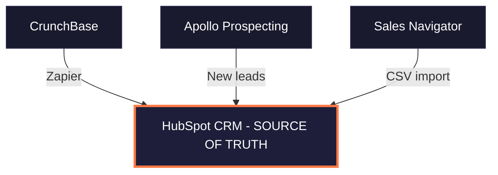
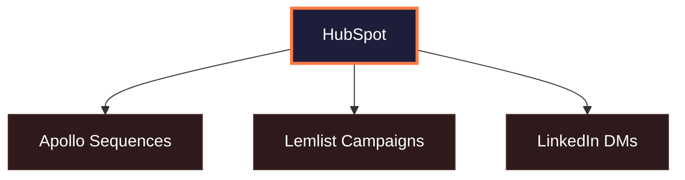
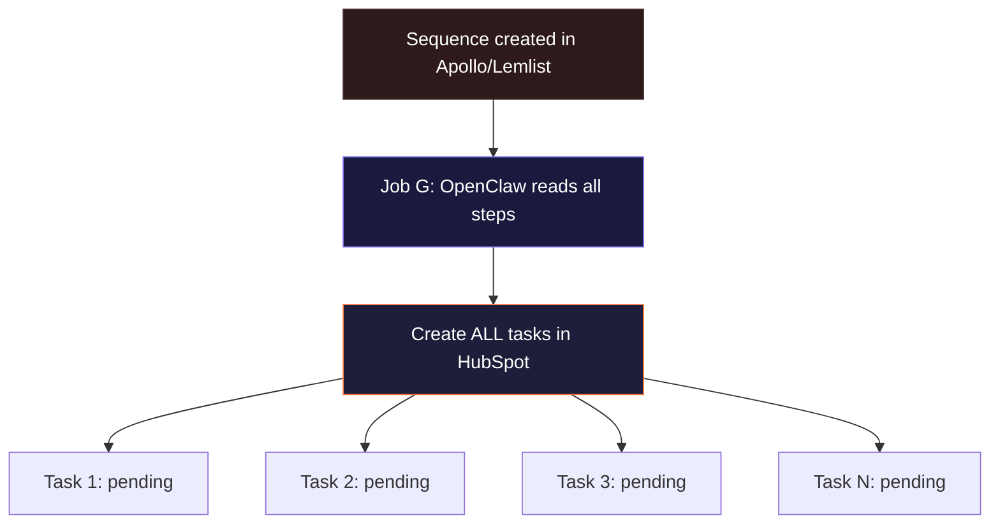
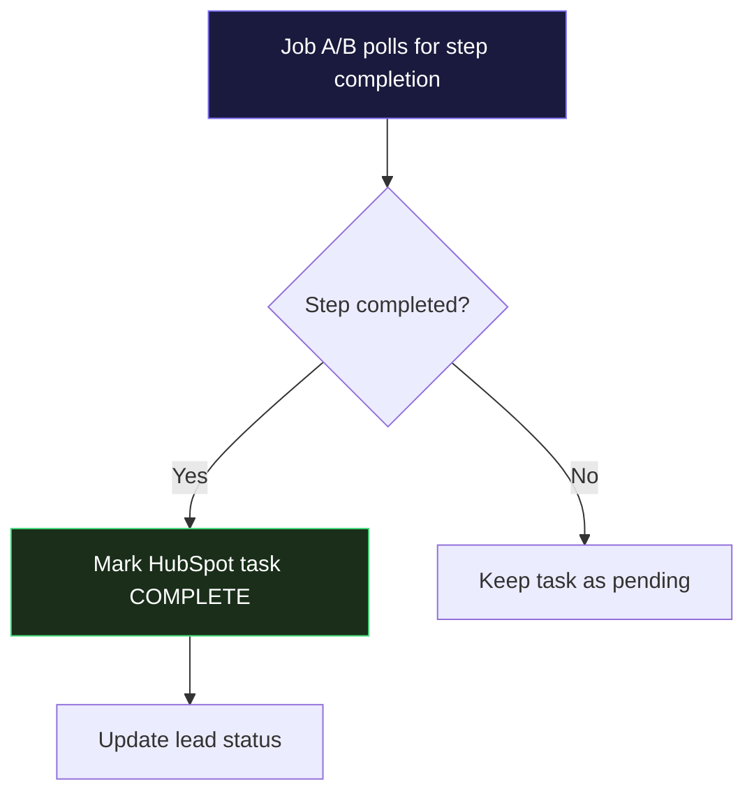
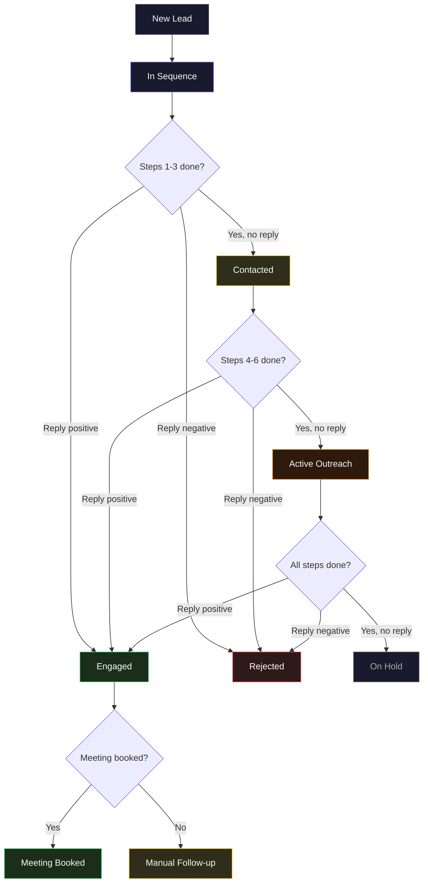
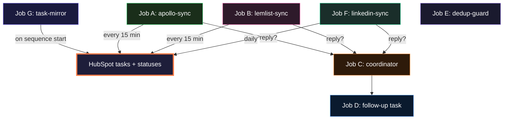
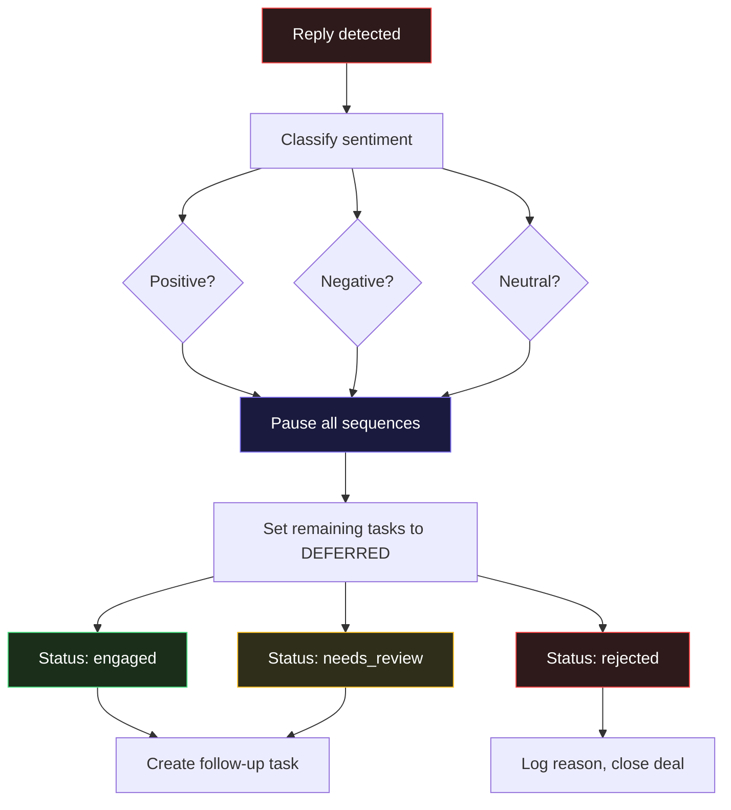
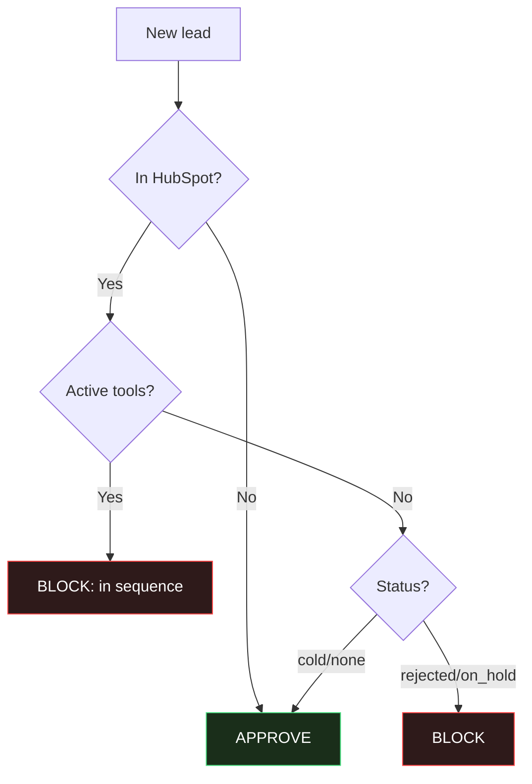

# Kernelics Email Outreach Automation

> HubSpot (source of truth) + Apollo + Lemlist + Sales Navigator + OpenClaw orchestrator

---

## System Overview

### 1. Lead Sources → HubSpot

### 2. Enrichment Loop

### 3. Outreach Channels

### 4. OpenClaw Orchestration

### 5. Outcomes

---

## Full Task Mirroring

**Core principle:** Every step in every sequence (Apollo, Lemlist, LinkedIn) is mirrored as a HubSpot task. You always see where every lead is across all channels.

### Example: 8-step multichannel sequence

| Step | Channel | Action | HubSpot Task Created |
|------|---------|--------|---------------------|
| 1 | Email (Apollo) | Send intro email | "Step 1/8: Intro email — {name}" |
| 2 | Email (Apollo) | Follow-up email | "Step 2/8: Follow-up — {name}" |
| 3 | LinkedIn | Send connection request | "Step 3/8: LinkedIn connect — {name}" |
| 4 | LinkedIn | Like/comment their post | "Step 4/8: LinkedIn engage — {name}" |
| 5 | Email (Apollo) | Value email | "Step 5/8: Value email — {name}" |
| 6 | LinkedIn | Send pitch DM | "Step 6/8: LinkedIn pitch — {name}" |
| 7 | Email (Apollo) | Case study email | "Step 7/8: Case study — {name}" |
| 8 | Email (Apollo) | Breakup email | "Step 8/8: Breakup — {name}" |

### How task mirroring works

### Task states in HubSpot

| HubSpot Task Status | Meaning |
|---------------------|---------|
| `NOT_STARTED` | Step not yet executed in source tool |
| `COMPLETED` | Step executed (email sent, LinkedIn action done) |
| `DEFERRED` | Paused due to reply on another channel |

---

## Automatic Lead Status Management

### Status flow diagram

### Status rules (what OpenClaw enforces)

| Trigger | New Status | Actions |
|---------|-----------|---------|
| Lead added to sequence | `in_sequence` | Create all HubSpot tasks for this lead |
| Steps 1-3 completed, no reply | `contacted` | Update deal stage |
| Steps 4-6 completed, no reply | `active_outreach` | Update deal stage |
| ALL steps completed, no reply | `on_hold` | Move deal to "Hold", stop monitoring |
| Reply — positive (any step) | `engaged` | Pause all sequences, create follow-up task, move deal to "Engaged" |
| Reply — negative (any step) | `rejected` | Pause all sequences, move deal to "Lost", log reason |
| Reply — neutral/unclear (any step) | `needs_review` | Pause all sequences, create task: "Review reply from {name}" |
| Meeting booked | `meeting_booked` | Remove from ALL sequences, move deal to "Meeting Booked" |
| No reply after hold period (30 days) | `cold` | Can be re-added to a different sequence later |

### Reply sentiment detection

OpenClaw classifies replies into 3 categories:

| Category | Example phrases | Status |
|----------|----------------|--------|
| **Positive** | "Sure, let's talk", "Send more info", "When are you free?" | `engaged` |
| **Negative** | "Not interested", "Remove me", "Don't contact me" | `rejected` |
| **Neutral** | "Who are you?", "What company?", auto-replies, OOO | `needs_review` |

---

## OpenClaw Jobs (Updated)

### Job overview

| Job | Type | Schedule | Description |
|-----|------|----------|-------------|
| **G** | Event | On sequence start | Mirror ALL sequence steps as HubSpot tasks |
| **A** | Cron | Every 15 min | Apollo → HubSpot: mark tasks complete, update status |
| **B** | Cron | Every 15 min | Lemlist → HubSpot: mark tasks complete, update status |
| **C** | Event | On reply | Classify reply, pause other channels, update status |
| **D** | Event | After C | Create manual follow-up task with context |
| **E** | Pre-hook | Before add | Block duplicates across tools |
| **F** | Cron | Daily | LinkedIn CSV → HubSpot: mark LinkedIn tasks complete |

---

## Job G: Task Mirror (NEW)

**Trigger:** When a lead is added to any sequence in Apollo or Lemlist

| Step | Action | API Call |
|------|--------|----------|
| 1 | Read full sequence definition from Apollo/Lemlist | `GET /v1/emailer_campaigns/{id}/emailer_steps` |
| 2 | For each step in sequence: | |
| | — Determine type (email / LinkedIn / wait) | |
| | — Calculate expected execution date | |
| 3 | Create HubSpot task per step | `POST /crm/v3/objects/tasks` |
| | Subject: "Step {N}/{total}: {type} — {lead_name}" | |
| | Body: step details, channel, template preview | |
| | Status: NOT_STARTED | |
| | Due date: expected execution date | |
| 4 | Associate all tasks with contact + deal | `PUT /crm/v3/objects/tasks/{id}/associations/...` |
| 5 | Set lead status to `in_sequence` | `PATCH /crm/v3/objects/contacts/{id}` |
| 6 | Set `total_steps` and `completed_steps = 0` | (same PATCH) |

**Result:** All 8 tasks (or however many) appear in HubSpot immediately. You can see the full plan for every lead.

---

## Job A: Apollo → HubSpot Sync (Updated)

**Schedule:** Every 15 minutes

| Step | Action | API Call |
|------|--------|----------|
| 1 | Poll Apollo sequences for step completions | `GET /v1/emailer_campaigns/{id}/emailer_steps` |
| 2 | For each completed step: | |
| | — Find matching HubSpot task | `POST /crm/v3/objects/tasks/search` |
| | — Mark task as COMPLETED | `PATCH /crm/v3/objects/tasks/{id}` |
| 3 | Update contact: `completed_steps += 1` | `PATCH /crm/v3/objects/contacts/{id}` |
| 4 | **Status check:** apply status rules | (see table below) |
| 5 | If reply detected → analyze sentiment → trigger Job C | internal |

### Status rules applied by Job A

| Condition | Action |
|-----------|--------|
| `completed_steps` reaches 3 and no reply | Set status → `contacted` |
| `completed_steps` reaches 6 and no reply | Set status → `active_outreach` |
| `completed_steps` equals `total_steps` and no reply | Set status → `on_hold` |
| Reply detected | Classify sentiment → trigger Job C |

---

## Job B: Lemlist → HubSpot Sync (Updated)

**Schedule:** Every 15 minutes

Same logic as Job A but reads from Lemlist API:

| Step | Action | API Call |
|------|--------|----------|
| 1 | Export Lemlist campaign activity | `GET /api/campaigns/{id}/export` |
| 2 | Map completed actions to HubSpot tasks | task search + PATCH |
| 3 | Update `completed_steps` on contact | contact PATCH |
| 4 | Apply same status rules as Job A | |
| 5 | If interested/replied → trigger Job C | |

**Lemlist advantage:** Lemlist tracks LinkedIn actions too (if using Multichannel Expert), so LinkedIn tasks can also be auto-completed via this job.

---

## Job C: Cross-Channel Reply Coordination (Updated)

**Trigger:** Called by Job A, B, or F when reply detected

### What happens to remaining tasks

When a lead replies at step 5 of an 8-step sequence:
- Steps 1-5: marked `COMPLETED`
- Steps 6-8: marked `DEFERRED` (not deleted — you can see what was planned)
- New task created: "Follow up: reply from {name} via {channel}"

---

## Job D: Follow-up Task Creation

**Trigger:** After Job C classifies a reply as positive or neutral

| Step | Action | API Call |
|------|--------|----------|
| 1 | Create follow-up task | `POST /crm/v3/objects/tasks` |
| | Subject: "REPLY: {name} via {channel} — {sentiment}" | |
| | Body includes: | |
| | — Reply content snippet | |
| | — Which step they replied at (e.g. "replied at step 5/8") | |
| | — Steps completed before reply | |
| | — Steps deferred (what was planned but not sent) | |
| | — Suggested next action based on sentiment | |
| 2 | Associate with contact + deal | associations API |
| 3 | Move deal to appropriate stage | `PATCH /crm/v3/objects/deals/{id}` |

---

## Job E: Dedup Guard

**Trigger:** Before any lead is added to a new sequence

---

## Job F: LinkedIn Manual Sync

**Schedule:** Daily (or on-demand)

| Step | Action | Tool |
|------|--------|------|
| 1 | Read Sales Navigator CSV export | OpenClaw |
| 2 | Parse: connection status, InMail status, DM replies | OpenClaw |
| 3 | Match to HubSpot contacts by name + company | HubSpot |
| 4 | Find LinkedIn-type tasks → mark COMPLETED | HubSpot |
| 5 | Update `completed_steps` on contact | HubSpot |
| 6 | Apply status rules (same as Job A) | OpenClaw |
| 7 | If LinkedIn reply detected → trigger Job C | OpenClaw |

**Future:** Lemlist Multichannel Expert automates LinkedIn actions and feeds back via API → replaces manual CSV

---

## Sync Matrix

| Data Point | Source | Destination | Direction | Synced By | Frequency |
|-----------|--------|-------------|-----------|-----------|-----------|
| Company accounts | CrunchBase | HubSpot | → | Zapier (existing) | Real-time |
| Contacts (new leads) | Apollo | HubSpot | ↔ | **OpenClaw** | Every 15 min |
| Contact enrichment | Apollo | HubSpot | → | Apollo native + **OpenClaw** | On enrichment |
| **Sequence steps → tasks** | **Apollo / Lemlist** | **HubSpot** | **→** | **OpenClaw (Job G)** | **On sequence start** |
| **Task completion** | **Apollo / Lemlist** | **HubSpot** | **→** | **OpenClaw (Job A/B)** | **Every 15 min** |
| **Lead status changes** | **OpenClaw** | **HubSpot** | **→** | **OpenClaw (auto)** | **On task completion / reply** |
| Email reply detection | Apollo | HubSpot | → | **OpenClaw** | Every 5 min |
| Lemlist reply/interested | Lemlist | HubSpot | → | **OpenClaw** | Every 5 min |
| LinkedIn outreach status | Sales Navigator | HubSpot | → | **OpenClaw** | Manual/CSV daily |
| Pause sequence (cross-channel) | OpenClaw | Apollo / Lemlist | → | **OpenClaw** | On reply event |
| Dedup check | HubSpot | Apollo / Lemlist | ← | **OpenClaw** | Before add |
| Buying intent signals | Apollo | HubSpot | → | **OpenClaw** | Daily |

---

## Existing Apollo ↔ HubSpot Sync (Already Configured)

### Enrichment jobs (running daily)

| Job Name | Source | Object | Enrichment | Limit |
|----------|--------|--------|------------|-------|
| Enrich Contacts Missing Emails | Apollo-source | Contact | Missing emails | 999/day |
| Job Enrichment Schedule | Waterfall-source | Contact | Job changes | 999/day |

### Contact field mapping (18 fields)

| Apollo Field | HubSpot Field | Direction |
|-------------|---------------|-----------|
| First name | First Name | ↔ |
| Last name | Last Name | ↔ |
| Current job | Job Title | ↔ |
| Default number | Phone Number | ↔ |
| Mobile number | Mobile Phone Number | ↔ |
| Primary email | Email | ↔ |
| City | City | ↔ |
| State | State/Region | ↔ |
| Country | Country/Region | ↔ |
| LinkedIn URL | LinkedIn URL | ↔ |
| Score | Contact score | ↔ |
| Owner | Contact owner | ↔ |
| Last added sequence name | Last added sequence name | ↔ |
| Last added sequence completed s… | Last added sequence completed s… | ↔ |
| Company Name | Company Name | → |
| Industry | Industry | → |
| List Name | List Name | → |
| Secondary email (1) | Secondary email | → |

### Account field mapping (24 fields)

| Apollo Field | HubSpot Field | Direction |
|-------------|---------------|-----------|
| Name | Company name | → |
| Website URL | Website URL | → |
| Domain | Company Domain Name | → |
| Description | Description | → |
| Primary industry | Industry | → |
| Secondary industries | Industry group | → |
| Number of employees | Number of Employees | → |
| Phone number | Phone Number | → |
| Street address | Street Address | → |
| City | City | → |
| State | State/Region | → |
| Country | Country/Region | → |
| Postal code | Postal Code | → |
| LinkedIn URL | LinkedIn Company Page | → |
| Total funding amount | Total Money Raised | → |
| Latest funding stage | Last funding type | → |
| Latest funding date | Last funding date | → |
| Revenue | Annual Revenue | → |
| Technologies | Technologies | → |
| Founded year | Year Founded | → |
| Number of job postings | Number of jobs postings | → |
| Score | Company score | ↔ |
| Owner | Company owner | ↔ |
| Record creation source | Record creation source | ← |

> **Note:** Key fields already syncing: `Last added sequence name` and `Last added sequence completed s…` — these are critical for Job A to detect sequence progress without extra API calls.

---

## HubSpot Custom Properties

### Contact properties

| Property Name | Type | Options / Format | Purpose |
|--------------|------|-----------------|---------|
| `lead_status` | Dropdown | in_sequence / contacted / active_outreach / on_hold / engaged / rejected / needs_review / meeting_booked / cold | Current status |
| `outreach_channel` | Dropdown | email / linkedin / both / none | Active channels |
| `total_steps` | Number | e.g. 8 | Total steps in current sequence |
| `completed_steps` | Number | e.g. 5 | Steps completed so far |
| `current_step` | Number | e.g. 6 | Next step to be executed |
| `reply_status` | Dropdown | no_reply / replied_positive / replied_negative / replied_neutral | Reply classification |
| `reply_channel` | Dropdown | apollo_email / lemlist_email / linkedin_dm / inmail | Where reply came from |
| `reply_step` | Number | e.g. 5 | At which step they replied |
| `active_tools` | Text | apollo,lemlist,linkedin (comma-separated) | Tools with active sequences |
| `last_sync_timestamp` | DateTime | ISO 8601 | Last OpenClaw sync |
| `apollo_campaign_id` | Text | Campaign ID | Link to Apollo sequence |
| `lemlist_campaign_id` | Text | Campaign ID | Link to Lemlist campaign |
| `intent_score` | Number | 1-100 | Apollo buying intent score |

### Deal stages (pipeline)

| Stage | Probability | Triggered by |
|-------|------------|-------------|
| New Lead | 10% | Lead added to HubSpot |
| In Sequence | 15% | Lead added to first sequence |
| Contacted | 20% | Steps 1-3 completed, no reply |
| Active Outreach | 30% | Steps 4-6 completed, no reply |
| Engaged | 50% | Positive or neutral reply |
| Meeting Booked | 70% | Meeting scheduled |
| On Hold | 5% | All steps completed, no reply |
| Rejected | 0% | Negative reply |
| Closed Won | 100% | Deal closed |
| Closed Lost | 0% | Deal lost |

---

## What You See in HubSpot

### Per lead — task list view

For a lead "John Smith" in an 8-step sequence, after step 5:

| Task | Status | Due | Channel |
|------|--------|-----|---------|
| Step 1/8: Intro email — John Smith | COMPLETED | Mar 15 | Apollo email |
| Step 2/8: Follow-up — John Smith | COMPLETED | Mar 18 | Apollo email |
| Step 3/8: LinkedIn connect — John Smith | COMPLETED | Mar 20 | LinkedIn |
| Step 4/8: LinkedIn engage — John Smith | COMPLETED | Mar 22 | LinkedIn |
| Step 5/8: Value email — John Smith | COMPLETED | Mar 25 | Apollo email |
| Step 6/8: LinkedIn pitch — John Smith | NOT_STARTED | Mar 28 | LinkedIn |
| Step 7/8: Case study — John Smith | NOT_STARTED | Apr 1 | Apollo email |
| Step 8/8: Breakup — John Smith | NOT_STARTED | Apr 5 | Apollo email |

**Lead status:** `active_outreach` (5/8 steps done, no reply)

### If John replies at step 5

| Task | Status | Due | Channel |
|------|--------|-----|---------|
| Step 1/8: Intro email — John Smith | COMPLETED | Mar 15 | Apollo email |
| Step 2/8: Follow-up — John Smith | COMPLETED | Mar 18 | Apollo email |
| Step 3/8: LinkedIn connect — John Smith | COMPLETED | Mar 20 | LinkedIn |
| Step 4/8: LinkedIn engage — John Smith | COMPLETED | Mar 22 | LinkedIn |
| Step 5/8: Value email — John Smith | COMPLETED | Mar 25 | Apollo email |
| Step 6/8: LinkedIn pitch — John Smith | DEFERRED | ~~Mar 28~~ | LinkedIn |
| Step 7/8: Case study — John Smith | DEFERRED | ~~Apr 1~~ | Apollo email |
| Step 8/8: Breakup — John Smith | DEFERRED | ~~Apr 5~~ | Apollo email |
| **REPLY: John Smith via email — positive** | **NOT_STARTED** | **Today** | **Manual** |

**Lead status:** `engaged` (replied positive at step 5/8)

---

## API Limits & Plan Constraints

### HubSpot Starter

| Limit | Value |
|-------|-------|
| API rate limit | 100 requests / 10 sec |
| Daily API limit | 250,000 requests |
| Batch operations | 100 records per batch |
| Custom properties | 1,000 per object |
| Workflows | **NOT available (Pro+)** |
| Tasks / Deals | Unlimited |

### Apollo Basic ($49/mo)

| Limit | Value |
|-------|-------|
| API rate limit | **1,000 requests / min** |
| Credits | 30,000 / user / year |
| Sequences | Available |
| Sequence API | Read + add/remove contacts |
| Webhooks | **NOT available (requires Pro)** |

### Lemlist

| Limit | Value |
|-------|-------|
| API rate limit | 10 requests / sec |
| Campaign API | Full CRUD |
| Webhooks | Available on paid plans |
| Multichannel | Email + LinkedIn (Expert plan) |

### Sales Navigator

| Limit | Value |
|-------|-------|
| Official API | **No public API** |
| Workaround | CSV export + OpenClaw processing |

---

> **Rate limits are generous.** Apollo Basic = 1,000 req/min, HubSpot = 100 req/10s (≈600/min). No batching tricks needed. The only constraint is Apollo credits (30k/year) — each enrichment burns 1 credit, so plan enrichment wisely.
