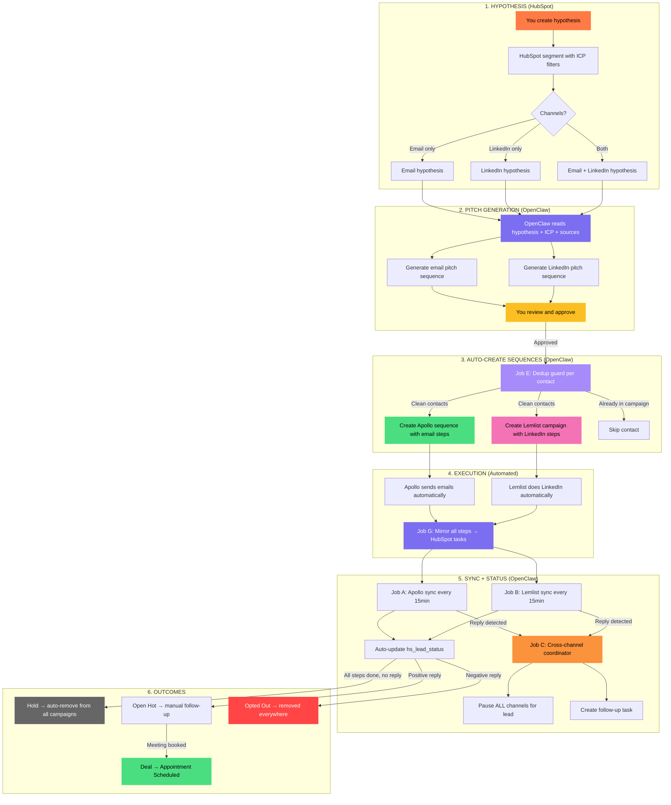
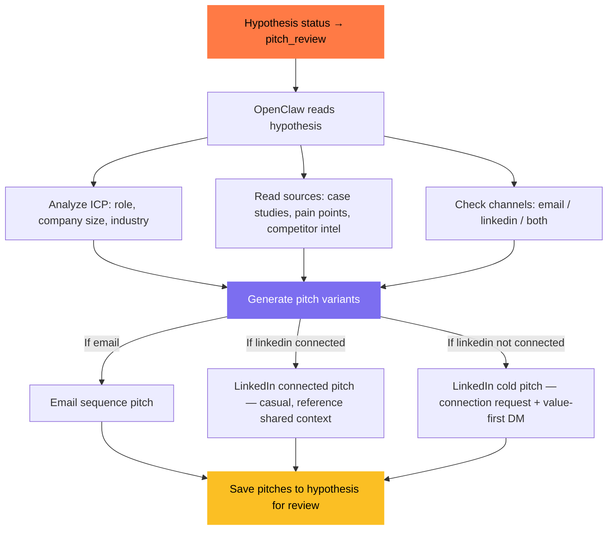
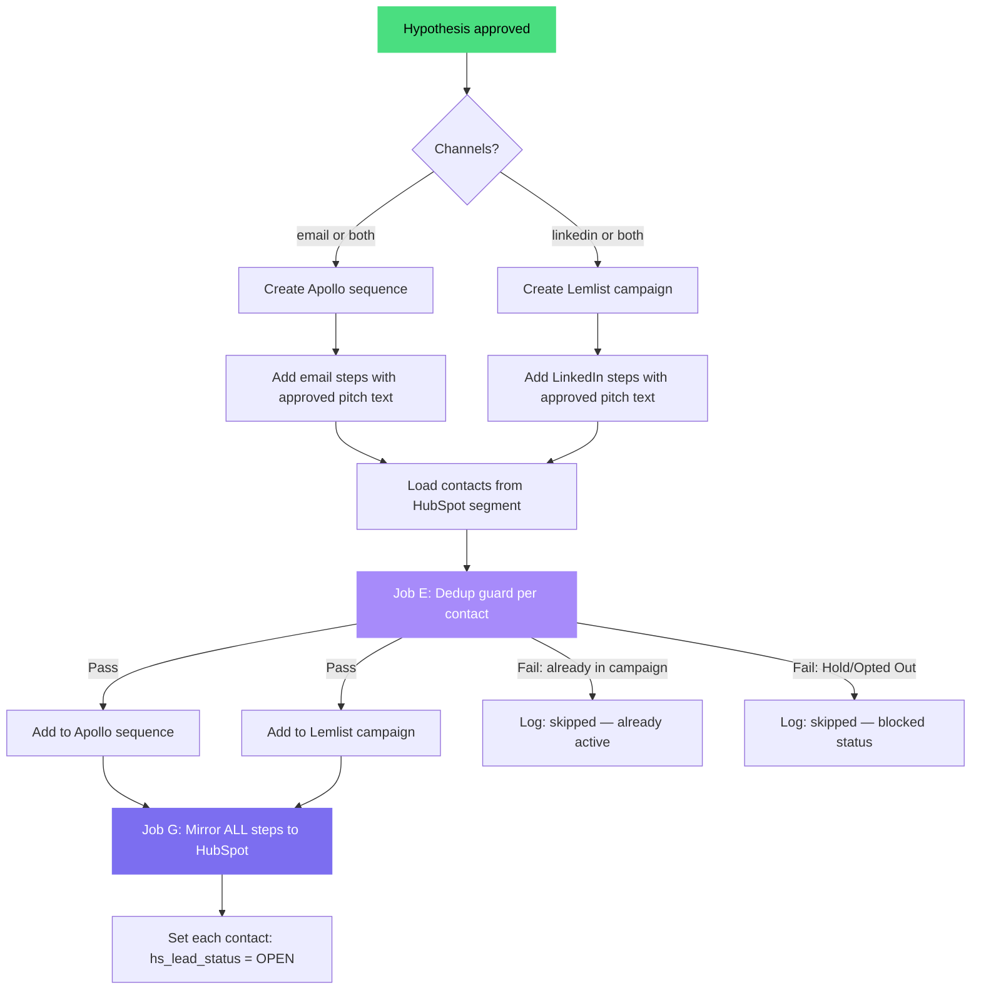
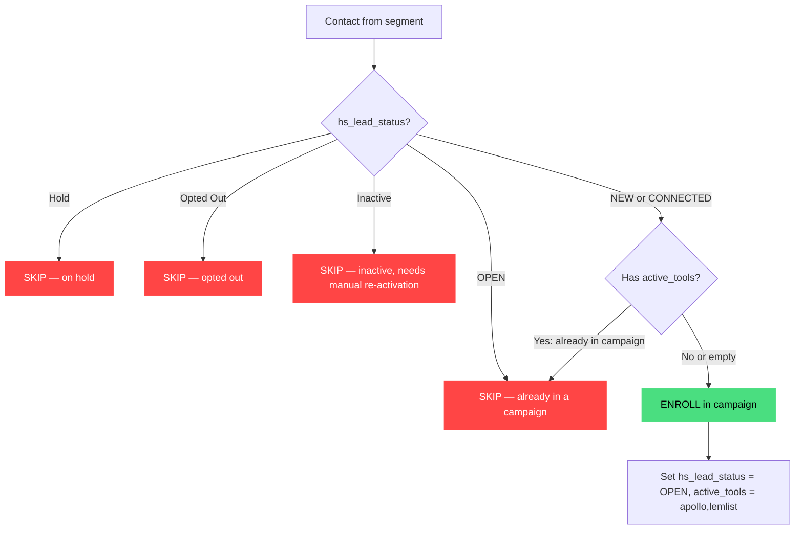
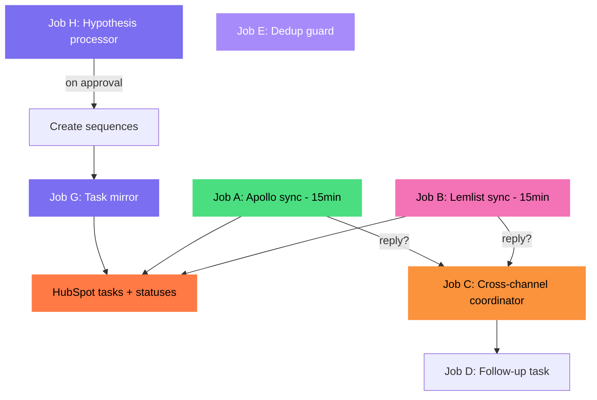
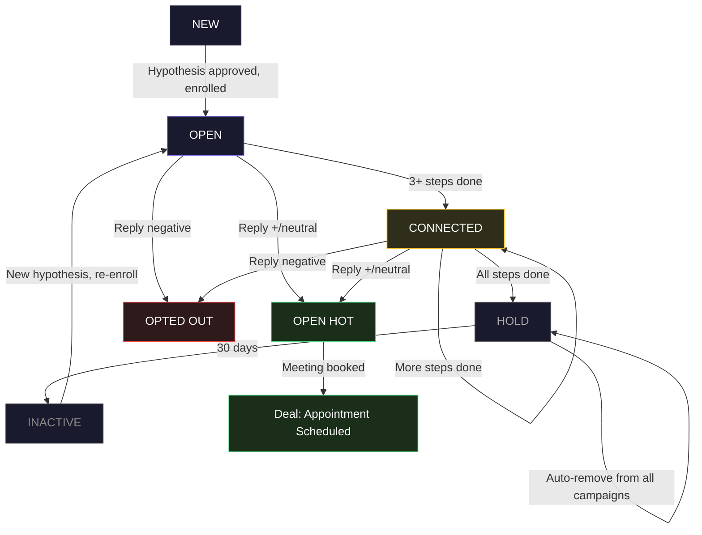
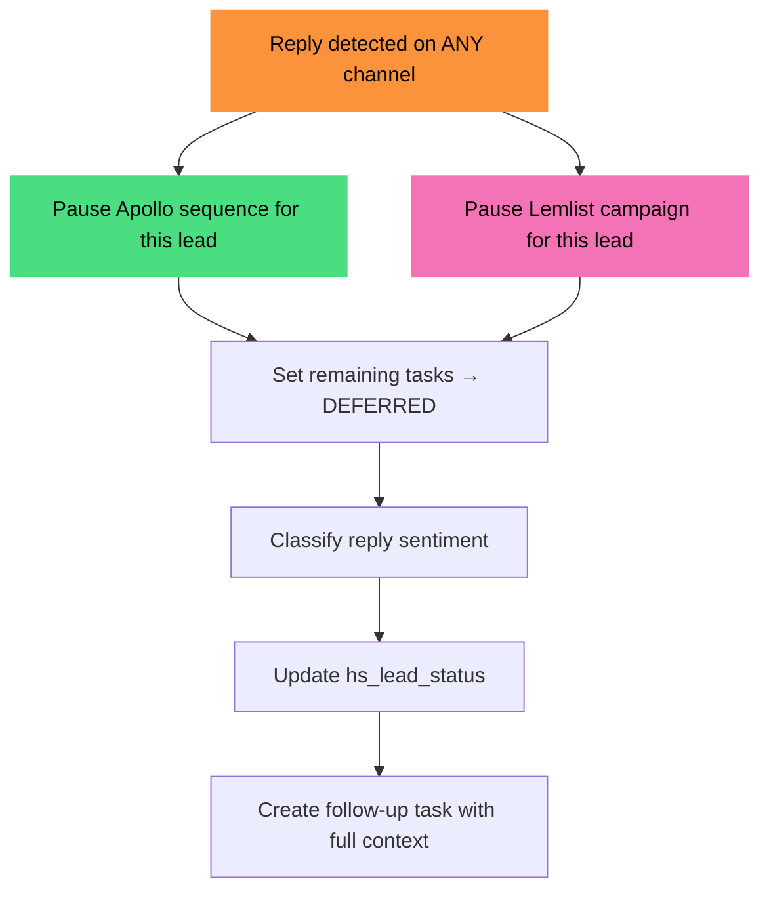
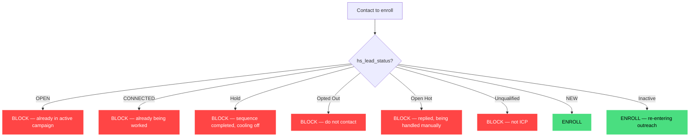

# Kernelics Email Outreach Automation

> Hypothesis-driven outreach orchestrated by OpenClaw. HubSpot (source of truth) + Apollo (email) + Lemlist (LinkedIn) + Sales Navigator.

---

## Summary

| What | How |
|------|-----|
| **Workflow starts with** | You create a **Hypothesis** in HubSpot (segment + ICP + channel choice) |
| **Pitch generation** | OpenClaw writes email + LinkedIn pitches based on hypothesis, ICP, and sources you pick |
| **You approve** | Review pitches, adjust, say "go" |
| **OpenClaw auto-creates** | Apollo sequence (email steps) + Lemlist campaign (LinkedIn steps) |
| **Contacts added** | From HubSpot segment, with dedup guard (no double-campaigns) |
| **Email automation** | Apollo sends emails automatically |
| **LinkedIn automation** | Lemlist handles connection requests, DMs, engagement — all automated |
| **Task mirroring** | Every step from both tools → HubSpot task (you see full timeline per lead) |
| **Status management** | `hs_lead_status` auto-updates based on progress + reply sentiment |
| **Cross-channel coordination** | Reply on any channel → pause ALL channels for that lead |
| **Hold = auto-remove** | Contact goes to `Hold` → removed from all active campaigns |
| **Dedup** | Contact already in a campaign → blocked from entering another |

---

## The Full Flow (End to End)

---

## Phase 1: Hypothesis Creation (You in HubSpot)

A **hypothesis** is a HubSpot segment (active list or static list) with metadata. Each hypothesis represents: "I believe reaching **these people** at **these companies** with **this message** via **these channels** will generate meetings."

### What a hypothesis contains

| Field | Example | Stored In |
|-------|---------|-----------|
| Hypothesis name | "Series A SaaS CTOs — migration play" | HubSpot list name |
| Target companies | Series A, SaaS, 50-200 employees | HubSpot list filters |
| Target roles | CTO, VP Engineering, Head of Platform | HubSpot list filters |
| Channels | Email + LinkedIn | Custom property: `hypothesis_channels` |
| Sources for pitch | Competitor X pain points, case study Y, blog post Z | Custom property: `hypothesis_sources` |
| LinkedIn approach | Connected / Not connected | Custom property: `hypothesis_linkedin_type` |
| Contacts | 50-200 contacts matching filters | HubSpot list members |

### Custom properties TO CREATE for hypothesis tracking

| Property | Internal Name | Object | Type | Purpose |
|----------|--------------|--------|------|---------|
| Hypothesis Name | `hypothesis_name` | Contact | Text | Which hypothesis this contact belongs to |
| Hypothesis Channels | `hypothesis_channels` | Contact | Dropdown: `email / linkedin / email_and_linkedin` | What channels for this hypothesis |
| Hypothesis Sources | `hypothesis_sources` | Contact | Textarea | Reference material for pitch generation |
| Hypothesis LinkedIn Type | `hypothesis_linkedin_type` | Contact | Dropdown: `connected / not_connected` | Whether LinkedIn pitch assumes existing connection |
| Hypothesis Status | `hypothesis_status` | Contact | Dropdown: `draft / pitch_review / approved / active / completed` | Workflow state of this hypothesis |

---

## Phase 2: Pitch Generation (OpenClaw)

When you mark a hypothesis as ready (`hypothesis_status` = `pitch_review`), OpenClaw reads it and generates pitches.

### How pitch generation works

### Pitch types OpenClaw generates

**Email pitch** (for Apollo sequence):

| Step | Template | Personalization |
|------|----------|----------------|
| 1 | Intro — pain point from sources | `{{first_name}}`, `{{company}}`, specific pain point |
| 2 | Follow-up — case study / social proof | Industry-relevant proof point |
| 3 | Value — insight or resource | Based on their tech stack / industry |
| 4 | Breakup — last chance, soft close | Reference previous emails |

**LinkedIn pitch — NOT connected** (for Lemlist campaign):

| Step | Action | Message |
|------|--------|---------|
| 1 | Connection request | Short note — shared industry / mutual connection / value prop |
| 2 | Wait for accept (3 days) | — |
| 3 | DM — intro message | Value-first, reference their work or company |
| 4 | Engage — like/comment their post | Build visibility |
| 5 | DM — follow up with resource | Share relevant content |

**LinkedIn pitch — CONNECTED** (for Lemlist campaign):

| Step | Action | Message |
|------|--------|---------|
| 1 | DM — warm intro | Reference existing connection, personal touch |
| 2 | Engage — like/comment their post | Stay visible |
| 3 | DM — share value/resource | Relevant to their role/company |
| 4 | DM — soft ask for meeting | Low pressure |

### You review and approve

OpenClaw saves generated pitches as a draft. You review in HubSpot (or a simple review interface OpenClaw provides). You can:
- Edit any pitch text
- Reorder steps
- Remove steps
- Ask OpenClaw to regenerate with different angle
- Approve → `hypothesis_status` = `approved`

---

## Phase 3: Auto-Create Sequences (OpenClaw)

When `hypothesis_status` = `approved`, OpenClaw automatically:

### 3a. Create sequences in tools

### 3b. Apollo sequence creation (API)

| Step | Action | API |
|------|--------|-----|
| 1 | Create new sequence | `POST /v1/emailer_campaigns` with name = hypothesis name |
| 2 | Add email steps with pitch text | `POST /v1/emailer_steps` per step |
| 3 | Set timing (day gaps between steps) | Step configuration |
| 4 | Activate sequence | `PATCH /v1/emailer_campaigns/{id}` active=true |

### 3c. Lemlist campaign creation (API)

| Step | Action | API |
|------|--------|-----|
| 1 | Create new campaign | `POST /api/campaigns` with name = hypothesis name |
| 2 | Add LinkedIn steps | `POST /api/campaigns/{id}/sequences` per step |
| 3 | Configure step types: `linkedinInvite`, `linkedinMessage`, `linkedinViewProfile` | Step type field |
| 4 | Start campaign | `PUT /api/campaigns/{id}/start` |

### 3d. Contact enrollment (with dedup)

For each contact in the HubSpot segment:

---

## Phase 4: Execution + Monitoring (Automated)

### Channel split: Apollo = Email, Lemlist = LinkedIn

| Tool | Handles | Automation Level |
|------|---------|-----------------|
| **Apollo** | All email steps (send, track opens, track replies) | Fully automatic |
| **Lemlist** | All LinkedIn steps (connection requests, DMs, profile views, post engagement) | Fully automatic (Expert plan) |
| **OpenClaw** | Orchestration, sync, status management, cross-channel coordination | Fully automatic |
| **HubSpot** | Source of truth — all tasks, statuses, contacts | Display + manual actions |

### Timing coordination between channels

When a hypothesis uses both email AND LinkedIn:

| Day | Apollo (Email) | Lemlist (LinkedIn) |
|-----|---------------|-------------------|
| 1 | Email 1: Intro | — |
| 2 | — | LinkedIn: Connection request |
| 4 | Email 2: Follow-up | — |
| 6 | — | LinkedIn: Engage (like/comment) |
| 9 | Email 3: Value | — |
| 12 | — | LinkedIn: DM with resource |
| 16 | Email 4: Breakup | — |

> OpenClaw coordinates the timing by setting appropriate delay days in both Apollo and Lemlist when creating the sequences.

---

## Phase 5: Sync + Status Management (OpenClaw Jobs)

### Job overview

| Job | Type | Schedule | What It Does |
|-----|------|----------|--------------|
| **H** | Event | On hypothesis approval | Read hypothesis → create Apollo sequence + Lemlist campaign → enroll contacts |
| **G** | Event | After H creates sequences | Mirror ALL steps from both tools → HubSpot tasks per contact |
| **A** | Cron | Every 15 min | Apollo → HubSpot: mark email tasks complete, detect replies |
| **B** | Cron | Every 15 min | Lemlist → HubSpot: mark LinkedIn tasks complete, detect replies |
| **C** | Event | On reply (from A or B) | Classify sentiment → pause ALL channels → update status |
| **D** | Event | After C | Create follow-up task with context |
| **E** | Pre-hook | Before enrollment | Block contacts already in campaigns or blocked statuses |

---

## Full Task Mirroring (Job G)

**Core principle:** Every step from every sequence (Apollo email + Lemlist LinkedIn) becomes a HubSpot task. You see the complete multichannel timeline per lead.

### Example: email + LinkedIn hypothesis (7 steps total)

| Task | Source | Type | Status | Due |
|------|--------|------|--------|-----|
| Step 1/7: Intro email — John Smith | Apollo | `EMAIL` | COMPLETED | Mar 15 |
| Step 2/7: LinkedIn connect — John Smith | Lemlist | `LINKED_IN_CONNECT` | COMPLETED | Mar 16 |
| Step 3/7: Follow-up email — John Smith | Apollo | `EMAIL` | COMPLETED | Mar 19 |
| Step 4/7: LinkedIn engage — John Smith | Lemlist | `LINKED_IN` | COMPLETED | Mar 21 |
| Step 5/7: Value email — John Smith | Apollo | `EMAIL` | IN_PROGRESS | Mar 24 |
| Step 6/7: LinkedIn DM — John Smith | Lemlist | `LINKED_IN_MESSAGE` | NOT_STARTED | Mar 27 |
| Step 7/7: Breakup email — John Smith | Apollo | `EMAIL` | NOT_STARTED | Apr 1 |

**hs_lead_status:** `CONNECTED` (4/7 steps done, no reply)

### Task type mapping

| Source Tool | Step Type | HubSpot `hs_task_type` |
|------------|-----------|----------------------|
| Apollo | Email send | `EMAIL` |
| Lemlist | Connection request | `LINKED_IN_CONNECT` |
| Lemlist | Profile view | `LINKED_IN` |
| Lemlist | DM / InMail | `LINKED_IN_MESSAGE` |
| Lemlist | Like / Comment | `LINKED_IN` |
| Manual | Follow-up call | `CALL` |
| OpenClaw | Review / action needed | `TODO` |

### Task statuses

| `hs_task_status` | Meaning |
|-----------------|---------|
| `NOT_STARTED` | Step not yet executed by Apollo/Lemlist |
| `IN_PROGRESS` | Step scheduled for today/in progress |
| `COMPLETED` | Step executed (email sent, LinkedIn action done) |
| `DEFERRED` | Paused — lead replied, remaining steps on hold |
| `WAITING` | Waiting for external event (e.g. connection accept) |

---

## Automatic Lead Status Management

Uses HubSpot's built-in `hs_lead_status` — no custom values needed.

### Status mapping

| Status | API Value | Meaning | Auto-Trigger |
|--------|-----------|---------|-------------|
| **New** | `NEW` | Just entered HubSpot, not in any sequence | Default on import |
| **Open** | `OPEN` | In an active campaign (emails + LinkedIn running) | Job H: on enrollment |
| **Connected** | `CONNECTED` | 3+ steps completed, no reply | Job A/B: step count |
| **Open Hot** | `Open Hot` | Replied positive or neutral — needs attention | Job C: on reply |
| **Opted Out** | `Opted Out` | Replied negative | Job C: on negative reply |
| **Hold** | `Hold` | All steps done, no reply — **auto-removed from all campaigns** | Job A/B: all done |
| **Inactive** | `Inactive` | 30+ days on hold — can re-sequence | Timer |
| **Unqualified** | `UNQUALIFIED` | Doesn't match ICP | Manual |

### Status flow

### Hold = auto-remove (important edge case)

When a contact reaches `Hold` status:

| Step | Action | API |
|------|--------|-----|
| 1 | Remove from Apollo sequence | `POST /v1/emailer_campaigns/{id}/remove_contact_ids` |
| 2 | Remove from Lemlist campaign | `DELETE /api/campaigns/{id}/leads/{email}` |
| 3 | Set `active_tools` = empty | `PATCH /crm/v3/objects/contacts/{id}` |
| 4 | All remaining tasks → `DEFERRED` | `PATCH /crm/v3/objects/tasks/{id}` per task |

---

## Reply Handling (Job C)

### Sentiment detection

| Category | Example | → Status | Actions |
|----------|---------|----------|---------|
| **Positive** | "Sure, let's talk", "Send more info" | `Open Hot` | Pause all, create follow-up task |
| **Negative** | "Not interested", "Remove me" | `Opted Out` | Remove from all campaigns, log reason |
| **Neutral** | "Who are you?", OOO, auto-reply | `Open Hot` | Pause all, create review task: "Check reply from {name}" |

### Cross-channel coordination

Reply on **email** (detected by Apollo) → OpenClaw pauses **Lemlist LinkedIn** campaign for that lead too.
Reply on **LinkedIn** (detected by Lemlist) → OpenClaw pauses **Apollo email** sequence for that lead too.

---

## Dedup Guard (Job E)

**Rule: A contact can only be in ONE active campaign at a time.**

> Only `NEW` and `Inactive` contacts can enter a new campaign. Everything else is blocked.

---

## What You See in HubSpot

### Per lead — full multichannel task timeline

**Before reply (5 of 7 steps done):**

| Task | Source | Status | Due |
|------|--------|--------|-----|
| Step 1/7: Intro email — John Smith | Apollo | COMPLETED | Mar 15 |
| Step 2/7: LinkedIn connect — John Smith | Lemlist | COMPLETED | Mar 16 |
| Step 3/7: Follow-up email — John Smith | Apollo | COMPLETED | Mar 19 |
| Step 4/7: LinkedIn engage — John Smith | Lemlist | COMPLETED | Mar 21 |
| Step 5/7: Value email — John Smith | Apollo | COMPLETED | Mar 24 |
| Step 6/7: LinkedIn DM — John Smith | Lemlist | NOT_STARTED | Mar 27 |
| Step 7/7: Breakup email — John Smith | Apollo | NOT_STARTED | Apr 1 |

**Status:** `CONNECTED` | **Hypothesis:** "Series A SaaS CTOs" | **Channels:** email + linkedin

### After reply at step 5 (positive):

| Task | Source | Status | Due |
|------|--------|--------|-----|
| Step 1/7: Intro email — John Smith | Apollo | COMPLETED | Mar 15 |
| Step 2/7: LinkedIn connect — John Smith | Lemlist | COMPLETED | Mar 16 |
| Step 3/7: Follow-up email — John Smith | Apollo | COMPLETED | Mar 19 |
| Step 4/7: LinkedIn engage — John Smith | Lemlist | COMPLETED | Mar 21 |
| Step 5/7: Value email — John Smith | Apollo | COMPLETED | Mar 24 |
| Step 6/7: LinkedIn DM — John Smith | Lemlist | **DEFERRED** | ~~Mar 27~~ |
| Step 7/7: Breakup email — John Smith | Apollo | **DEFERRED** | ~~Apr 1~~ |
| **REPLY: John Smith via email — positive** | OpenClaw | **NOT_STARTED** | **Today** |

**Status:** `Open Hot` | **Reply sentiment:** positive | **Replied at step:** 5/7

---

## HubSpot Properties

### Already existing (no changes)

| Property | API Name | Source |
|----------|----------|-------|
| Lead Status | `hs_lead_status` | Built-in (8 options) |
| Contact Score | `contact_score` | Apollo sync |
| Contact Type | `contact_type` | Custom |
| Lead Source | `lead_source` | Custom |
| Last Sequence Name | `last_added_sequence_name` | Apollo sync |
| Sequence Step | `last_added_sequence_completed_step` | Apollo sync |
| LinkedIn URL | `linkedin_url` | Apollo sync |
| Company Score | `company_score` | Apollo sync |
| Technologies | `technologies` | Apollo sync |
| CrunchBase Link | `crunchbase_link` | Zapier |

### Custom properties TO CREATE

**Contact properties:**

| Property | Internal Name | Type | Purpose |
|----------|--------------|------|---------|
| Hypothesis Name | `hypothesis_name` | Text | Active hypothesis for this contact |
| Hypothesis Channels | `hypothesis_channels` | Dropdown: `email / linkedin / email_and_linkedin` | Channels for this outreach |
| Hypothesis Sources | `hypothesis_sources` | Textarea | Source material for pitch generation |
| Hypothesis LinkedIn Type | `hypothesis_linkedin_type` | Dropdown: `connected / not_connected` | LinkedIn connection status |
| Hypothesis Status | `hypothesis_status` | Dropdown: `draft / pitch_review / approved / active / completed` | Workflow state |
| Total Steps | `total_steps` | Number | Total steps across all channels |
| Completed Steps | `completed_steps` | Number | Steps completed so far |
| Current Step | `current_step` | Number | Next step to execute |
| Reply Sentiment | `reply_sentiment` | Dropdown: `positive / negative / neutral / none` | AI-classified |
| Reply Channel | `reply_channel` | Dropdown: `apollo_email / lemlist_linkedin / manual` | Where reply came from |
| Reply Step | `reply_step` | Number | At which step they replied |
| Active Tools | `active_tools` | Text | Comma-separated: `apollo,lemlist` |
| Apollo Campaign ID | `apollo_campaign_id` | Text | Link to Apollo sequence |
| Lemlist Campaign ID | `lemlist_campaign_id` | Text | Link to Lemlist campaign |
| Last Sync | `openclaw_last_sync` | DateTime | Last OpenClaw sync |

---

## Deal Pipeline (Actual)

**Sales Pipeline** — deal only created when meeting is booked:

| Order | Stage | API ID | Probability | Trigger |
|-------|-------|--------|------------|---------|
| 0 | Appointment Scheduled | `appointmentscheduled` | 20% | Meeting booked (from `Open Hot`) |
| 1 | Qualified To Buy | `qualifiedtobuy` | 40% | After discovery call |
| 2 | Prices Sent | `presentationscheduled` | 60% | After proposal |
| 3 | Approved | `decisionmakerboughtin` | 80% | Verbal yes |
| 4 | Contract Sent | `contractsent` | 90% | Contract out |
| 5 | Closed Won | `closedwon` | 100% | Signed |
| 6 | Closed Lost | `closedlost` | 0% | Lost or negative reply |

> No deal is created during outreach. The lead status tracks everything until a meeting happens.

---

## Existing Sync (Already Configured)

### Apollo enrichment jobs (running daily)

| Job | Source | Enrichment | Limit |
|-----|--------|------------|-------|
| Enrich Contacts Missing Emails | Apollo-source | Missing emails | 999/day |
| Job Enrichment Schedule | Waterfall-source | Job changes | 999/day |

### Field mappings (already syncing)

- **18 contact fields**: name, email, phone, job title, LinkedIn URL, city, state, country, score, owner, sequence name, sequence step, company name, industry, list name, secondary email
- **24 account fields**: company name, website, domain, description, industry, employees, phone, address, city, state, country, postal code, LinkedIn page, funding amount, funding stage, funding date, revenue, technologies, founded year, job postings, score, owner, record source

> Full mapping tables available in previous version. Key fields for automation: `last_added_sequence_name` and `last_added_sequence_completed_step` sync automatically from Apollo.

---

## API Limits

| Platform | Rate Limit | Key Constraint |
|----------|-----------|---------------|
| **HubSpot Starter** | 100 req / 10 sec (≈600/min) | No native workflows — OpenClaw replaces them |
| **Apollo Basic** | 1,000 req / min | 30k credits/year — plan enrichment wisely |
| **Lemlist** | 10 req / sec | Webhooks available — real-time reply detection |
| **Sales Navigator** | No public API | CSV export workaround |

> Rate limits are generous. No batching needed. The constraint is Apollo credits (30k/year for enrichment).

---

## OpenClaw Job Details

### Job H: Hypothesis Processor (NEW — central job)

**Trigger:** `hypothesis_status` changes to `approved`

| Step | Action | API |
|------|--------|-----|
| 1 | Read hypothesis: name, channels, sources, LinkedIn type | HubSpot `GET /crm/v3/objects/contacts/search` by hypothesis |
| 2 | Get contacts from HubSpot segment | HubSpot list members API |
| 3 | Run dedup guard (Job E) on each contact | Internal |
| 4 | If email channel: create Apollo sequence with pitch steps | Apollo `POST /v1/emailer_campaigns` |
| 5 | If LinkedIn channel: create Lemlist campaign with pitch steps | Lemlist `POST /api/campaigns` |
| 6 | Enroll clean contacts in Apollo sequence | Apollo `POST /v1/emailer_campaigns/{id}/add_contact_ids` |
| 7 | Enroll clean contacts in Lemlist campaign | Lemlist `POST /api/campaigns/{id}/leads` |
| 8 | Trigger Job G to mirror all steps to HubSpot | Internal |
| 9 | Set each contact: `hs_lead_status` = `OPEN`, `active_tools`, campaign IDs | HubSpot PATCH |
| 10 | Update `hypothesis_status` = `active` | HubSpot PATCH |

### Job G: Task Mirror

**Trigger:** After Job H enrolls contacts

| Step | Action | API |
|------|--------|-----|
| 1 | Read all steps from Apollo sequence | `GET /v1/emailer_campaigns/{id}` |
| 2 | Read all steps from Lemlist campaign | `GET /api/campaigns/{id}/sequences` |
| 3 | Merge into unified timeline (ordered by day) | Internal |
| 4 | Per contact: create one HubSpot task per step | `POST /crm/v3/objects/tasks` |
| 5 | Associate tasks with contact | Associations API |
| 6 | Set `total_steps` on contact | PATCH contact |

### Job A: Apollo → HubSpot Sync

**Schedule:** Every 15 minutes

| Step | Action |
|------|--------|
| 1 | Poll Apollo for step completions per contact |
| 2 | Mark matching HubSpot tasks as `COMPLETED` |
| 3 | Update `completed_steps` on contact |
| 4 | If `completed_steps` ≥ 3 and no reply → status `CONNECTED` |
| 5 | If all steps done and no reply → status `Hold` + auto-remove |
| 6 | If reply detected → trigger Job C |

### Job B: Lemlist → HubSpot Sync

**Schedule:** Every 15 minutes

Same logic as Job A but reads from Lemlist API. Lemlist tracks all LinkedIn actions automatically (Expert plan), so LinkedIn task completion is real, not manual.

### Job C: Cross-Channel Coordinator

**Trigger:** Reply detected by Job A or Job B

| Step | Action |
|------|--------|
| 1 | Classify reply sentiment (positive / negative / neutral) |
| 2 | Pause Apollo sequence for this contact |
| 3 | Pause Lemlist campaign for this contact |
| 4 | Set remaining HubSpot tasks → `DEFERRED` |
| 5 | Update `hs_lead_status` based on sentiment |
| 6 | Trigger Job D to create follow-up task |

### Job D: Follow-up Task Creator

**Trigger:** After Job C

Creates a HubSpot task:
- Subject: `REPLY: {name} via {channel} — {sentiment}`
- Body: reply content, step number, completed steps, deferred steps, suggested next action
- Type: `TODO`
- Associated with contact

### Job E: Dedup Guard

**Trigger:** Before enrollment (called by Job H)

Only allows `NEW` and `Inactive` contacts. Blocks everything else. Logs every skip with reason.
